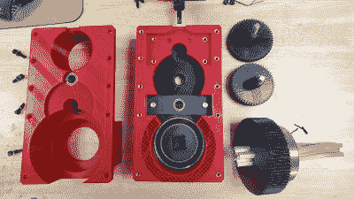

# 看那深红色的斧头(不要插入手指)

> 原文：<https://hackaday.com/2019/08/20/behold-the-crimson-axlefcker-do-not-insert-finger/>

你的铝型材太直了吗？深红 Axlef*cker 可以帮你解决问题。这是一个非凡的 3D 打印，4 级，125:1 减速齿轮箱由无刷电机驱动。设计师[jlittle988]决定测试一个早期原型的破坏情况，虽然他预计到某个东西会断裂，但他没想到它会在此之前扭曲 2020 铝挤压轴。我们认为在那之后这个名字就被保留了下来。

Internals of the first prototype, shaft of BLDC motor just visible at top. Twisted 2020 extrusion output shaft at bottom right.

[jlittle988]已经在 reddit 上记录了构建进度，[最近发布了一个令人着迷的视频(嵌入在下面),显示了修改后的变速箱进一步扭曲了输出轴](https://www.reddit.com/r/3Dprinting/comments/crdih3/the_crimson_axlefucker_claims_another_victim/)。他对大局有点含糊其辞，只说这个部门是一个更大项目的一部分。事实上，尽管进行了炫耀性的测试，他的目标并不是简单地获得最大扭矩。我们只能猜测他更大的项目是什么，但与此同时，看到变速箱的结果是一些很好的清洁乐趣。他首先在这里宣布了变速箱测试结果，紧接着是[的一些修改](https://www.reddit.com/r/3Dprinting/comments/cq3aa7/your_friendly_neighborhood_axlefucker_is_gearing/)，然后是前面提到的视频。还有一个[内部的图库](https://imgur.com/gallery/mmKeMin)，所以去看看吧。

深红 Axlef*cker 由一个 [ODrive 无刷双轴电机](https://odriverobotics.com/shop/odrive-custom-motor-d5065)和一个 ODrive 控制器驱动；就是这个 ODrive，它的[开源电机控制器设计](https://hackaday.io/project/11583-odrive-high-performance-motor-control)在过去给我们留下了深刻的印象。

在像这样的项目和像摆线传动这样的其他齿轮箱[之间，很明显，定制齿轮箱设计是 3D 打印敞开的另一扇门，允许爱好者推动甚至在几年前都不可行的发展。](https://hackaday.com/2018/08/24/a-peek-at-the-mesmerizing-action-of-a-cycloidal-drive/)

 <https://hackaday.com/wp-content/uploads/2019/08/The-Crimson-Axlefucker-claims-another-victim.mp4?_=1>

[https://hackaday.com/wp-content/uploads/2019/08/The-Crimson-Axlefucker-claims-another-victim.mp4](https://hackaday.com/wp-content/uploads/2019/08/The-Crimson-Axlefucker-claims-another-victim.mp4)