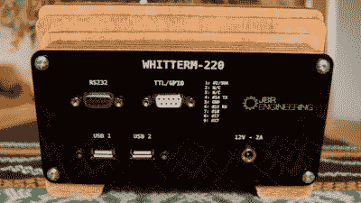

# 请看 WT-220:一个“聪明”的 VT-220 终端

> 原文：<https://hackaday.com/2018/12/20/behold-the-wt-220-a-clever-vt-220-terminal/>

[John Whittington]未能在易贝赢得旧 VT-220 串行终端的投标，因此他决定制作自己的版本，并在此过程中不断改进。[结果是 Whitterm-220](https://engineer.john-whittington.co.uk/2016/06/whitterm-220-clever-serial-terminal/) (或 WT-220)，其核心是一个树莓 Pi，因此不仅仅能够充当一个“哑”串行终端。

Rear of the WT-220 with paint-filled laser engraving and all necessary connectors.

外壳由激光切割的胶合板堆叠而成，背面有一个丙烯酸板用于标签和连接器，在剥离丙烯酸保护膜之前，[John]在标签雕刻中加入油漆。通过在激光雕刻之后但在剥离薄膜之前涂上颜料，它起到了填充的作用，并真正使文字变得流行起来。

靠近前面，胶合板层中的一层透明丙烯酸树脂充当光导和电源指示器，还兼作 TX/RX 活动灯。当电源打开时，该层会发光，作为一个有吸引力的指示器，不会干扰观看屏幕。当发送或接收数据时，连接到串行线路的简单缓冲电路会点亮 led 以显示 TX 或 RX 活动，并能够通过切换 GPIO 引脚来使能或禁用该功能。下面嵌入了一个视频概览，您可以看到该单元的运行情况。

 [https://www.youtube.com/embed/GRzD-fUQnak?version=3&rel=1&showsearch=0&showinfo=1&iv_load_policy=1&fs=1&hl=en-US&autohide=2&wmode=transparent](https://www.youtube.com/embed/GRzD-fUQnak?version=3&rel=1&showsearch=0&showinfo=1&iv_load_policy=1&fs=1&hl=en-US&autohide=2&wmode=transparent)

串行终端似乎总能在项目中找到一席之地，无论它们是装在口袋里还是配有滑出式键盘的 3D 打印外壳(T2)。