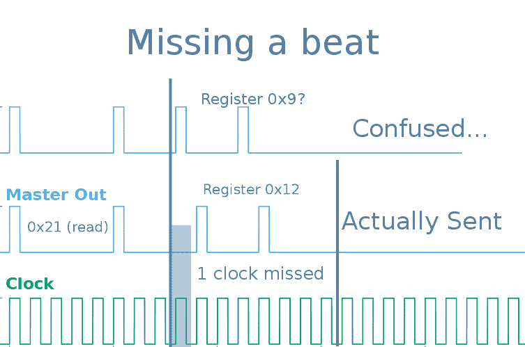

# 成为 SPI 从机可能比看起来更棘手

> 原文：<https://hackaday.com/2019/01/08/being-a-spi-slave-can-be-trickier-than-it-appears/>

与外界接口是微控制器相当常见的任务。在某些用例之外，微控制器可以说主要是有用的，因为它们可以很容易地与其他设备接口。如果我们只是想读和写一些数据，我们不会得到那个 Arduino！但是有些任务比其他任务更常见；例如，我们习惯于在接口等式的主端，而不是从端。(那是设计温度传感器的 TI 工程师的工作吧？)正如[Pat]在[模仿缺失的 SPI GPIO 扩展器](https://flyingcarsandstuff.com/2017/02/creating-a-sensor-or-peripheral-with-an-spi-slave-interface/)时发现的那样，有时扮演另一个角色可能会遇到意想不到的困难。

SPI 从机的简单例子就是:简单。 [SPI 可以因其明显的简单性而变得精彩](https://hackaday.com/2016/07/01/what-could-go-wrong-spi/)。与 I2C 不同，这里没有奇怪的寻址方案、读/写位、停止和开始时钟条件。你拨动时钟线，一点数据就出来了，当然，只要你有[右极性方案](http://dlnware.com/theory/SPI-Transfer-Modes)。作为从设备，基本算法具有相当的复杂性。在时钟引脚上设置一个中断，等待您的片选置位，并在每个时钟沿移出当前字的下一位。看看[Pat]非常易读的代码，看看它有多简单。

但是最后一点就是复杂性所在。当你是主人时，就像是顶级掠食者，丛林之王，首席项目经理。你决定节奏，车上的每个人都跟着你的时钟节拍跳舞。当然，SRAM 的数据手册上说它的运行速度不能超过 8 MHz，但你真的相信吗？除非你试着把那个钟开快一点，看看有没有更快的传送。当你是从机时，你必须在每个时钟沿都做好准备*。句号。比如说，由于一个错误的打印语句导致的哪怕是一个比特的丢失，都会以难以检测和恢复的方式破坏事务的其余部分。您的从代码需要能够检测到这些问题，以便为下一个事务进行重置。等待发送已经结束的事务的第 8 位是不行的。*

查看[Pat]非常友好的帖子，了解 SPI 以及他们解决构建 SPI 从机问题的发现。关于如何在执行其他任务的设备中保持响应，有一些有用的提示。