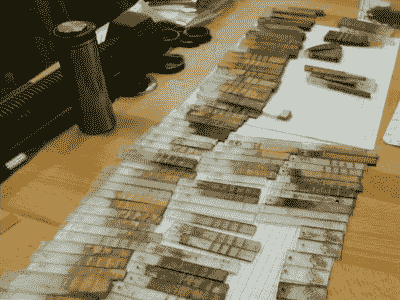

# 超级公司的本·克拉斯诺:在你自己的商店里制造外星技术

> 原文：<https://hackaday.com/2019/01/28/ben-krasnow-at-supercon-making-alien-technology-in-your-own-shop/>

本·克拉斯诺对未来的电子设备有一个设想:柔性电路将直接沉积在设备本身的塑料体上，将物理物体和电子设备融合在一起，而不是现在的将印刷电路板拧进塑料盒的结构。现在已经有了塑料覆铜技术，但是 [Ben 在这次演讲中提出了一些新奇的东西](https://www.youtube.com/watch?v=Tx2B5hI4w1U)你可以自己实现。你可能还想要一个显示器，或者至少是能闪烁的东西，所以他也在研究一些电致发光技术来补充它。如果你想知道为什么本[现在对丝网印刷感光聚合物](https://hackaday.com/2019/01/23/adventures-in-photopolymers-with-ben-krasnow/)如此感兴趣，观看这个演讲将会把许多有趣的线索拉在一起。

 [https://www.youtube.com/embed/Tx2B5hI4w1U?version=3&rel=1&showsearch=0&showinfo=1&iv_load_policy=1&fs=1&hl=en-US&autohide=2&wmode=transparent](https://www.youtube.com/embed/Tx2B5hI4w1U?version=3&rel=1&showsearch=0&showinfo=1&iv_load_policy=1&fs=1&hl=en-US&autohide=2&wmode=transparent)

本的研究是真正的前沿。家庭游戏玩家可以制作原型，但还不能用于工业生产。当然，现在有一种在塑料上制作电路的工业技术。他们不能做电镀通孔，塑料需要一种特殊的催化剂在注射成型过程中混合，这个过程需要重型 YAG 激光器。它很贵，所以你只能对高利润的项目使用这种方法，除非你的车库看起来与我们的不同，否则这对于家庭黑客来说是不可行的。

This is what science in progress looks like

本的目标是“用便宜的零件代替昂贵的零件”。他希望能够将催化剂涂在 3D 打印部件上，而不是注射成型，并且他希望能够用低于 100 美元的二氧化碳激光器绘制电路。这里展示的结果背后有很多伟大的实验，但最终结果是这样的工作流程:用聚四氟乙烯自行车链润滑剂涂覆塑料，以防止催化剂粘附。在需要铜痕迹的地方用激光去除润滑剂，将零件浸入润湿剂中，使催化剂在激光去除的地方粘得更好，然后浸入催化剂和无电镀铜浴中。嘭！

这个过程是新颖的，负担得起的，并且它使用了一些我们已经可以使用的工具。看完这个演讲后，没有什么能阻止你开始做这件事。本已经在 2D 塑料表面上对此进行了测试，完全 3D 电镀电路的主要绊脚石似乎是获得一台 5 轴激光机。注意，使用本的技术，任何被激光击中的区域都会吸引铜；如果你能用激光在基板上烧孔，你就可以免费得到电镀通孔。

正如承诺的那样，本在演讲的最后部分进入了闪烁模式。他买了一些现成的电致发光涂料，但这种材料需要高电压。所以他设计了自己的驱动电路来提供足够的能量。如果你在帕萨迪纳和我们在一起，你肯定会注意到他在演讲前整天戴着的手套。如果你是观众，你可能会随着他用彩色高压像素滚动整个超级电脑一起唱歌。

自从 3D 打印革命开始以来，我们都在想我们是否可以 3D 打印电路，从而实现一次性机电设计过程。这篇演讲概述了我们可以达到目的的一种方式，并为你为什么想加入本的旅程提出了一些令人信服的论点。谁将是第一个在家庭实验室复制这个实验的人？或者用更好的激光装置让它更上一层楼？