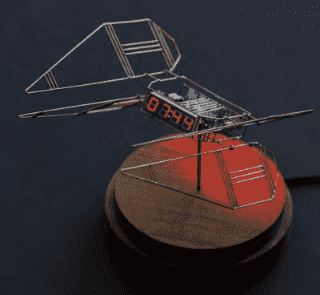

# 像博伊特一样弯曲它:电路雕塑打破了平地的界限

> 原文：<https://hackaday.com/2019/12/27/bend-it-like-bhoite-circuit-sculptures-shatter-the-bounds-of-flatland/>

作为电子爱好者，我们生活在一个有点二维的世界。我们的工艺是如此以印刷电路板为中心，以至于我们的设计工具是专门为董事会定制的文件，他们可以给我们提供玻璃纤维和铜的研究。我们涂抹助焊剂和焊料，添加元件，加热，就像变魔术一样，我们的电路变得栩栩如生，所有这些都在 PCB 上下几毫米的范围内。

打破这种自我强加的平坦地带可以起到治疗作用。至少这是 Mohit Bhoite 对他的自由形式电路雕塑的看法，他在今年的 Hackaday 超级会议上详细谈到了这些雕塑。作为披露，我不得不承认我是莫希特作品的长期粉丝，无论是在他作为粒子设计师的日常工作中，还是在他用电子元件和铜丝[创作雕塑的业余爱好中，这些都可以在他的 Twitter feed](https://twitter.com/MohitBhoite) 上关注。在去 Supercon 之前，他加入了我们的[电路雕塑黑客聊天室](https://hackaday.io/event/167692-circuit-sculpture-hack-chat)，所以我不仅期待见到他，我还确信他的演讲将揭示他的艺术秘密，并给我灵感开始创作自己的作品。我对这两点都不失望。

## 不是秘密；只是很多细致的工作

至于他的秘密方法，事实证明真的没有。工具非常简单:高质量的钳子和带有不伤眼球的电线固定器的平切刀，一个 50 瓦的焊接站，以及诸如机械师方尺之类的校准工具。他的大多数雕塑都是由直径从 0.3 毫米到 1.0 毫米的坚硬黄铜棒制成，这些黄铜棒很容易弯曲。他使用全尺寸的纸模板来指导他的弯曲，尽管 3D 打印夹具在诸如构建分立 led 矩阵的工作中发挥了作用。组件悬浮在金属丝框架内，形成开放、通风的结构，邀请你从各个角度观看它们。

 莫希特用他平易近人的方法和材料提供了大量灵感。他的许多早期作品源于他对光束机器人技术的兴趣，这些简单的电路除了让 LED 闪烁或发出有趣的声音之外没什么别的作用。有些雕塑比较实用，比如[床头数字钟](https://www.bhoite.com/sculptures/seven-seg-1/)。其他的是模式和形式的探索，像[他的带着阿拉伯式翅膀的 TIE 战斗机](https://www.bhoite.com/sculptures/tie-fighter/)。甚至还有一些更具互动性的项目，比如让你在一个小型 led 矩阵上玩蛇的手持游戏控制台，或者建立在铜管底盘上的念珠机器人。

我认为莫希特赛道雕塑最打动我的是它们的个性。他甚至在演讲一开始就提到了这一点，这一点在他的设计中得到了体现。他使用的角度，显示器和 led 的放置方式，以及每件作品的总体感觉都让你在看他的作品时马上知道。他的作品也有一些令人平静的东西，好像它们以某种方式捕捉了工程师工作日的放松和逃离压力，这是这种爱好的目的。

观看莫希特的雕塑有点像在凝视一个禅宗岩石花园。除了他的作品和他的演讲激发了我拿起钳子和电线开始弯曲，而不是拿起耙子来整理砾石和沙子。

 [https://www.youtube.com/embed/LqVFxNFGNbc?version=3&rel=1&showsearch=0&showinfo=1&iv_load_policy=1&fs=1&hl=en-US&autohide=2&wmode=transparent](https://www.youtube.com/embed/LqVFxNFGNbc?version=3&rel=1&showsearch=0&showinfo=1&iv_load_policy=1&fs=1&hl=en-US&autohide=2&wmode=transparent)

