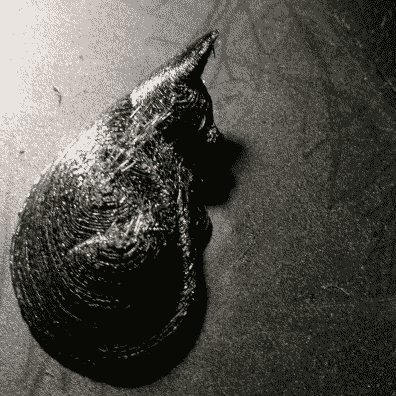
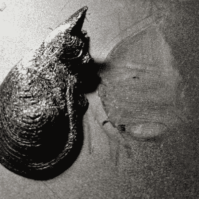
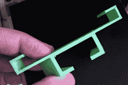

# 通过磁铁实现更好的 3D 打印

> 原文：<https://hackaday.com/2018/11/05/better-3d-printing-through-magnets/>

就像 Goldilocks 发现有些粥太热，有些太冷一样，3D 打印机经常有粘得不够好或粘得太好的床。几周前，我把三台打印机中的两台换成了磁床，我想和你分享一下这是如何实现的。剧透:像大多数东西一样，它有它的优点和缺点。

众所周知，3D 打印不是即插即用的操作，尤其是在我们大多数人愿意为打印机支付的价格上。有很多变量需要正确处理:温度、速度、床的水平和一堆其他的东西。然而，困扰许多人的一件事是，粘上第一层和完成后能够从床上取下来之间的关系。很难找到一个快乐的媒介。如果第一层粘不住，你的印刷就完蛋了。如果第一层粘得太好，你很可能会损坏零件或手指。我很早以前就换成了 [BuildTak surfaces，](https://hackaday.com/2016/10/07/buildtak-pei-and-early-adopter-syndrome/)还有很多人喜欢 PEI。但有时很难切除大部分。几周前，我冒险为我的两台打印机买了一些磁性构建表面。这些都是来自阿里快递的“无名”廉价事务。

这个想法很简单。有两个薄片看起来像橡胶塑料，具有磁性。其中一块背面有 3M 胶。另一个有一个类似 BuildTak 的表面。一旦你把这一张纸粘住，就不要去管它了。然后你把另一张纸放在上面，在上面打印。完成后，您可以拉出纸张并弯曲它，以弹出打印。总之，理论上是这样的。

## 装置

安装真的很容易。如果你买了合适的尺寸，就把它放在你现有的床上。如果你买了一个更大的尺寸——如果你有一个小的印花床，你可能会想要，正如你将看到的——你可以用相当好的剪刀剪材料。但是，如果你正在切割一个矩形，要小心:两块材料以某种方式锁在一起。如果你把最上面的那块以正确的角度旋转到“正确的方向”,最上面的那一层就不会粘得很好。在正确的方向上，当顶层锁定底层时，您可以感觉到满意的“咔嚓”声。

如果你有一张小一点的床，你可能会想买一张大一点的然后剪下来。原因如下。顶层相当脆弱。你可能想用较小的零件来印刷较小的图案，以避免因为印刷小钥匙链而磨损较大的零件。底层似乎不会磨损太多，所以你可以在底部覆盖整个表面，然后使用较小的顶部面板，这些面板不会覆盖整个打印区域。

## 在使用中

印刷和你想象的差不多。这两条床单可以增加你的床的厚度。我不得不把我的打印头抬高大约 2.5 毫米。如果你的打印机有这方面的调整，你可以用那个。如果它自动调平，您可能需要设置一个新的偏移量，这取决于您使用的传感器类型。你也可以像我一样，在你的 g 代码里放一个负的偏移量(比如 G92 Z-0.20)，把头部向上移动 0.2 mm。

问题来了。像 BuildTak 一样，如果头部靠得很近，材料会粘得太好。使用 PETG 塑料，我的第一次尝试真的很难粘在盘子上。剥去部分工作，但它也留下了非常薄的顶部表面的眼泪。您最好将偏移设置得非常高，然后慢慢降低它，直到您得到一个很好的折衷方案。

下面的图片展示了 PETG 印刷的一只沉睡的猫。右边的图片显示了头部有点低是如何在材料上留下永久凹痕的，表面也有一个小裂缝。

  Cat print before removal  After removal

PETG 似乎真的很难坚持。使用 PLA 更容易拨号。下面的绿色部分是 PLA，印在带磁性床的 Monoprice mini 上。PLA 的另一个好处是你不需要太多的床加热来使用它。毫无疑问，当你的热敏电阻显示床上的温度为 70°C 时，这些多层材料顶部的温度就会降低。你可能需要做出相应的调整。然而，这种材料不能耐受高温，因此印刷 ABS 可能不好，也不是一个好主意，因为它会把热的头拖得离表面太近。

## 结论

值得努力吗？我不确定。这肯定比仅仅使用一张 BuildTak 更挑剔。虽然 BuildTak 和类似的材料不会永远存在，但它们似乎不像磁性板那样容易被撕碎。我还觉得 PETG 很难找到一个甜蜜点，在这个点上，它保持得足够好，但又不太好。

我还没见过有人只卖顶层的，但是很明显，你会想要一个顶层的备份，因为它很容易损坏。这会增加成本，但我考虑过在顶层上再加一层实际的 BuildTak，但我没有尝试。不过，这应该行得通。

我也没有尝试更贵的磁片。很难说它们是否真的会变得更好，如果它们只是一样的，只是增加了中间商的加价。

好消息是，当它真的起作用时，效果非常好。解放军是非常愉快的只是弹出关闭。当然，PLA 在 BuildTak 上发布得也很好，所以除了去掉印刷的新奇之处，我不清楚这是否真的更好。话又说回来，对于解放军来说，可能也不会更糟。对于 20 美元左右的升级来说，这还不错。只是不要期待奇迹。