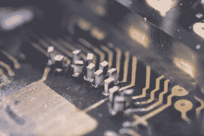

# BGA 手工焊接使用 Tombstone 电阻技术，要求手术精度

> 原文：<https://hackaday.com/2019/07/08/bga-hand-soldering-uses-tombstone-resistor-technique-demands-surgical-precision/>

大多数 Hackaday 读者都是烙铁的行家里手。我们可以组装表面贴装电路板，SOICs 和 TSSOPs 轻而易举，0402 我们迈着大步，面对 0201 我们开怀大笑。但是[来自【Greg Davill】](https://twitter.com/GregDavill/status/1145001336213082113)的一条 Twitter 帖子可能会让除了最铁杆的艺术支持者之外的所有人都感到困惑，因为他将 BGA 封装中的微型 FPGA 手工连接到微型点阵 LED 显示模块的背面。

Resistors soldered on-end, awaiting wires to connect to the BGA microcontroller

据我们所知，该模块必须曾经有自己的微控制器已被删除。我们猜测它在环氧树脂滴下，但不能确定，同时它的焊盘暴露在外。LP1k49 晶格恰好适合这个空间，但需要一个细小的金属线网将其连接到这些焊盘上。首先，[Greg]用一组“墓碑式”微小(我们猜测是 0R)电阻填充焊盘，然后用 30μm 导线将它们连接到焊盘。他描述了当他试图给一根散落的头发着色时的困惑，头发燃烧而不是接受焊料。

结果是一个带有新大脑的工作显示器，这甚至让他也感到惊讶。这些年来，我们已经看到了不止一条 BGA 线路，但很少有如此大规模的。

值得一提的是，[Greg]是去年 Hackaday 奖亚军 FLIR 帧抓取器的幕后推手。我们钦佩他能够得到的所有他的项目的照片，并渴望在我们自己的项目中达到这一水平。以此为灵感，然后查看[目前正在举行的美丽硬件图像黑客大赛](https://hackaday.com/2019/07/02/new-contest-beautiful-hardware/)。

谢谢[索菲]的提示。