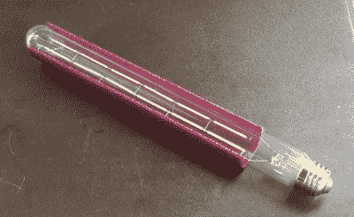

# 大型 3D 打印灯尝试一些新功能

> 原文：<https://hackaday.com/2021/07/14/big-3d-printed-lamp-tries-some-new-features/>

在灯具设计中，由于灯泡在使用过程中会变热，因此通常会给它们留出足够的间隙。然而，LED 灯泡发出的热量相对较少，这打开了一些新的大门。[Mark re host]用他的定制 3D 打印机和一个 1 毫米直径的喷嘴制作了这个巨大的 3D 打印灯[，最终的设备不仅看起来很棒，而且展示了一些简洁的设计特征。](https://drmrehorst.blogspot.com/2021/05/another-printed-lamp.html)

The LED filament bulb doesn’t give off much heat, so a PETG partial shade mounted directly to the bulb works fine.

[Mark]在 PETG 印刷了部分灯罩，直接安装在灯泡上。灯罩的后部是开放的，让光线从后面溢出，而灯泡的前部被遮挡，使眼睛更容易看到。结果非常漂亮，正如你在这里看到的。它位于 600 毫米高的灯的中心，占据了他自制的基于 CoreXY 的打印机 UMMD 的大部分体积。

这种风格的灯泡中的 LED 灯丝以其自己的方式非常整洁，你们中的一些人可能还记得，当它们第一次作为单独的组件出现时，[没有时间去寻找是什么使它们滴答作响](https://hackaday.com/2015/04/18/mike-illuminates-us-on-led-filaments/)。