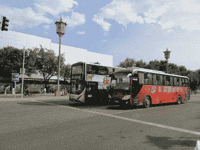

# 大哥还是哑哥？北京的公交车司机被迫佩戴“情绪监测器”

> 原文：<https://hackaday.com/2022/10/03/big-brother-or-dumb-brother-bus-drivers-in-beijing-are-forced-to-wear-emotional-monitors/>

人类并不总是尊重彼此的隐私。然而，常识告诉我们，一个人头脑中的想法和内心的感受是有明确界限的。

然而，对于北京的公交车司机来说，似乎不再是这样了。这些职业司机现在被要求在工作时佩戴情绪监测器，这引起了法律和隐私倡导者的关注。但是这些设备实际上只不过是锻炼监视器，它们是否真的能实现奥威尔式的承诺还有待观察。

## 在你脑子里，在你脑子里！

The monitoring wristbands have been rolled out to some of Beijing’s long-distance bus drivers. Credit: Cypp0847, [CC-BY-SA-4.0](https://commons.wikimedia.org/wiki/File:Beijing_cy_Photos_13.jpg)

当乔治·奥威尔写下《1984 年的 T1》时，还只是 1949 年。然而，他能够预见一个监控无处不在且不可避免的世界。他还提出了*思想犯罪的概念，在这种情况下，仅仅考虑错误的事情就可能让你与当局陷入严重的麻烦。*

众所周知，奥威尔错得离谱——这些预测直到 21 世纪初才成为现实。在最新的令人震惊的发展中，现在存在的技术声称能够监控一个人的情绪状态。现在，中国的交通部门正忙着让他们加入劳动力大军。

北京的长途汽车司机现在被告知上班时要佩戴电子腕带。这些腕带声称能够捕捉佩戴者的情绪状态，代表雇主对其进行监控。这个计划是北京公共交通控股集团的主意。这个国营组织声称这项技术是为了公众的安全，腕带的试验于今年 7 月开始。

技术相对粗糙。它不扫描脑电波，也不在有意识的层面上直接与人交流。相反，它像普通的智能手表一样监控司机的生命体征。腕带可以捕捉体温、心率、血氧水平和呼吸数据。据报道，他们还测量血压、运动量和用户的睡眠模式。

所有这些数据经过处理后，就可以得出佩戴者的情绪状态。组织可以实时监控腕带，以实时跟踪其员工。

法律专家质疑监控计划的价值。问题涉及腕带得出的结论的有效性，以及这可能对员工产生的影响。那些经常被腕带评为“愤怒”或“不安”的人可能会受到歧视或失去工作，无论他们的情绪状态是否被准确评估，甚至是否会影响他们的工作。像情绪状态这样主观和可塑的东西，也很难看出机器如何能可靠地得出结论。

至于数据，也不清楚它在实践中会如何使用。如果发生撞车事故，员工的腕带报告他们“激动”或“悲伤”，这将如何影响接下来发生的事情？毕竟，在糟糕的交通状况下，我们中的许多人可能会变得恼火和沮丧，如果另一个司机碰巧用我们的车造成了事故，那绝对没有任何意义。很难想象这项技术会被用于惩罚之外的其他用途。

## 令人担忧的趋势

这个计划是否有意义似乎在更广泛的计划中并不重要。这种腕带符合现代中国社会压倒性的主题——压倒性的、无处不在的监控。这个国家已经运行了“社会信用”系统，根据公民的犯罪历史、经济活动和公共行为对其进行评级。如果与这些发生冲突，你可能会突然发现很难申请政府许可，甚至很难通过铁路、海上或空中旅行。这些监测腕带只是已经在中国进行的监测的又一次扩展。

然而，其他国家很难认为自己没有这种担忧。世界各地的仓库员工的行为经常受到监控，他们可能会因为工作太慢或上厕所太多而受到处罚。员工在优步和 Doordash 等应用上的每一个动作都同样被监控、排名和严格分析。同样，表现或行为不佳会很快受到惩罚。的确，这样的例子不胜枚举，但这并不能让人接受。

一旦这些技术变得可用，公司和政府通常都急于实现它们。在缺乏强大的个人隐私保护的情况下，这些技术侵犯个人自由的风险总是很大。在大多数国家，这些根本不存在。当然，有时强制服从不是通过威胁一个人的工作或自由，而是以更柔和的方式。我们对社交媒体、流媒体服务或网络搜索的访问依赖于允许企业收集我们日常活动的大量信息，这种情况太普遍了。

就这些腕带而言，威胁甚至不是来自新的先进技术。该系统只能收集像典型智能手表一样的数据，并配有一个复杂或愚蠢的情绪匹配算法，这取决于你的观点。

真正的威胁是这样一个事实，即人们的生计正被置于危险之中，其依据是他们几乎没有选择佩戴的腕带的虚假测量和数学。对于那些认为自己的身体、思想和灵魂应该是私人空间的人来说，这树立了一个糟糕的先例。

横幅照片:奥莱·本迪克·克维斯伯格的《北京女公交司机》。

迈克尔·伍德的《北京公交》