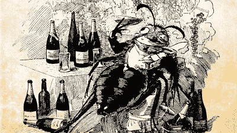

# 19 世纪的生物黑客或世界如何几乎失去了葡萄酒

> 原文：<https://hackaday.com/2019/06/03/biological-hacking-in-the-19th-century-or-how-the-world-almost-lost-wine/>

虽然这并不十分普遍，但很多人偶尔会喜欢喝一杯葡萄酒。但在 19 世纪，世界面临一场危机，这场危机几乎摧毁了世界上一些顶级葡萄酒。科学——或者有些人可能会说黑客——拯救了这一天，尽管它在严肃的品酒者之外并不为人所知。你可能想知道生物黑客是如何在 19 世纪发生的。确实如此。它没有那么快或有效率，但幸运的是，对于喝葡萄酒的人来说，它完成了任务。

当人们告诉我新的网络安全威胁时，我通常会指出网络犯罪并不新鲜。几个世纪以来，人们一直在偷钱，欺骗人们，冒充他人。电脑只是让它变得更容易。甚至计算本身也不是一个新想法。用手指数和用电子数只是程度问题。当然，混搭生物学是最近的科学进步，对吗？虽然 CRISPR 确实可以让编辑基因成为一个周末车库项目，但几个世纪以来，人们一直在使用选择性育种和嫁接等技术改变植物和动物的生物学。没那么有效，但有时足够有效。

## 葡萄的愤怒

虽然世界各地都有葡萄酒，但法国和葡萄酒之间有着明显的联系。当欧洲人来到新大陆时，他们经常带着葡萄。虽然葡萄在美国生长得很好，但大多数本地品种并不适合酿酒。几乎所有你可能喝的葡萄酒都使用单一品种的葡萄:*葡萄*。因为酿酒师已经使用这种葡萄几个世纪了，他们知道如何从中获得他们想要的味道。有美国本土的葡萄可以用来酿酒，但它们并不占世界葡萄酒消费总量的很大一部分。

由于这个原因，殖民者经常种植旧世界的葡萄。然而，有些人喜欢用新世界葡萄做实验，正如你所料，一些葡萄树找到了去欧洲的路。

## 问题的根源

在 19 世纪中期，大多数国家都没有关于活体植物进出口的真正法规。寻找有趣的酿酒杂交葡萄的生物学家会以美洲植物为研究对象。如果只是一两棵葡萄树，那就不太值得注意了。然而，葡萄藤有一个不受欢迎的访客:根瘤蚜——一种蚜虫。

这些基本上是攻击葡萄藤的蚜虫。这些在欧洲并不存在，显然，美洲的葡萄对它们有抵抗力，至少在某种程度上。但是殖民者试图种植欧洲葡萄藤，但失败了，这可以追溯到 16 世纪。他们不知道为什么，但众所周知的是，欧洲葡萄无法在美洲的大部分地区生长，加州是个例外，因为蚜虫还没有到达西部那么远的地方。

 根瘤蚜的鼻子上有一根毒液管，当蚜虫从根部吸取汁液时，毒液就会毒害植物。等到植物死亡时，蚜虫已经拔起木桩，转移到新的植物上。因此，挖出一株死亡的植物通常不会显示出任何感染，这可能是为什么殖民者不明白是什么杀死了植物。

但是回到法国。1863 年，普杰特市的一个葡萄园的植物死于不明原因。不久之后，一种未知的瘟疫肆虐法国各地的葡萄园，但直到 1868 年科学家才开始了解这是一种微小的昆虫。即使在那时，他们也不确定，直到 1870 年维克多·安托万·西格诺特证实了这一点。

尽管有令人信服的证据，一些人认为虫害是一些其他根本原因的次要原因。一组种植者尝试了各种杀虫剂，但运气不佳。一些人把蟾蜍放在每根藤下，希望它们能吃掉虫子。超过 40%的法国葡萄枯萎，法国经济损失约 100 亿法郎。

最终证明可行的是进行一点 19 世纪的生物黑客技术。欧洲葡萄藤被嫁接到来自德克萨斯州的葡萄藤的根部。虫子攻击树根，但是这些树根有抵抗力，所以虫子不想要它们。与此同时，葡萄果实会像往常一样生长，即使是附着在抗性根上。

## 后果

对于根瘤蚜仍然没有补救措施，没有嫁接的葡萄树被小心保护。自然地，人们会争论嫁接葡萄酒和自根葡萄酒的味道，但是绝大多数的葡萄酒来自嫁接的葡萄藤。不是所有的根在欧洲的土壤中都长得很好，但是葡萄的根长得最好。今天，根也可能来自*夏葡萄*、*野葡萄*或*贝兰葡萄*。

你可能认为关于味道的争论是吹毛求疵，但是嫁接的葡萄藤有实际的物理差异。例如，与非嫁接的同类相比，嫁接的仙粉黛葡萄通常在特定植株上生长出更多大小差异的葡萄。此外，一些根从周围土壤中吸收的氮和钾比原来的根多，这可以改变土壤的 pH 值。随着土壤化学性质的改变，葡萄酒的味道也可能改变。一些人认为区别不在于根，而在于葡萄藤的年龄，因为嫁接的葡萄藤往往更年轻。不过，就像大多数品味问题一样，很难说清楚。然而，大多数专家同意，如果有差异，也不是很大的差异。

下面的视频声称科学测试表明没有区别。视频里有一个关于这个话题的很好的讲座。那段视频提到 75%的法国作品被这些虫子毁了——我们的消息来源说是 40%,但无论如何仍然是一个巨大的成功。

 [https://www.youtube.com/embed/FKN7SG8RM2w?version=3&rel=1&showsearch=0&showinfo=1&iv_load_policy=1&fs=1&hl=en-US&autohide=2&wmode=transparent](https://www.youtube.com/embed/FKN7SG8RM2w?version=3&rel=1&showsearch=0&showinfo=1&iv_load_policy=1&fs=1&hl=en-US&autohide=2&wmode=transparent)

## 生物黑客

我们认为生物黑客是一种现代追求，但事实是它已经持续了很长时间。饲养狗、植物或牛实际上是生物黑客。这只是缓慢的，低技术含量的生物黑客。然而，我不禁想知道，就像生物黑客和网络犯罪在数字时代之前已经持续了许多年一样，历史上还有哪些事情可以通过注入技术而做得更好？

当然，如果葡萄酒对你的调色板来说太精致了，那么总会有啤酒，而且是用 CRISPR 进行了基因编辑的。就连二战也有一个我们之前报道过的[老式生物黑客故事](https://hackaday.com/2015/07/30/the-biohacking-movement-and-open-source-insulin/)。