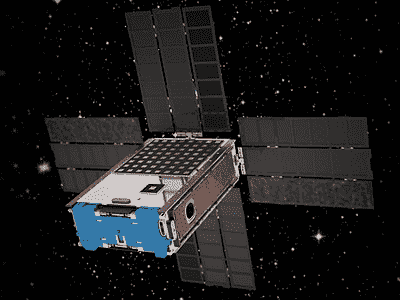
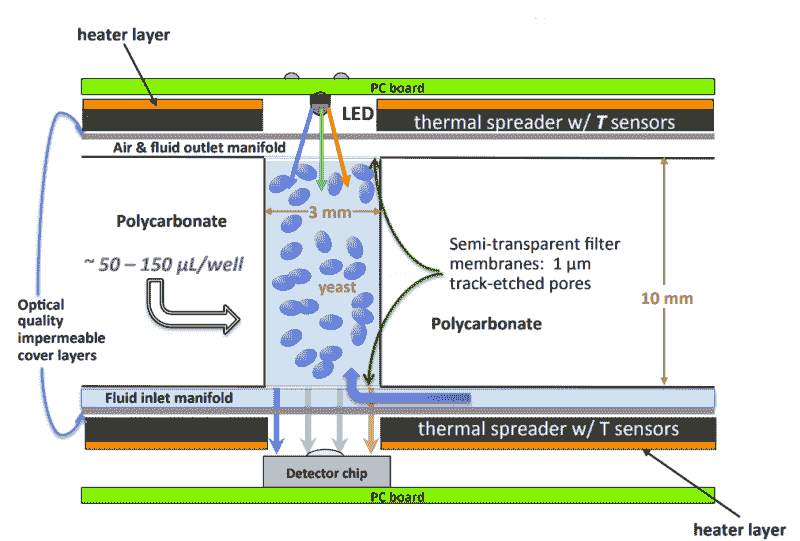

# BioSentinel 任务旨在将酵母送入深空

> 原文：<https://hackaday.com/2019/06/11/biosentinel-mission-aims-to-put-yeast-into-deep-space/>

对于太空爱好者来说，这真是一个激动人心的时刻。人类终于摆脱了长达半个世纪的深空探测的低迷，并计划重返月球和向火星进军。是的，自从阿波罗的光辉岁月以来，激动人心的事情已经发生了。我们已经[到达外行星](https://hackaday.com/2018/05/25/hacking-when-it-counts-the-pioneer-missions/)，[在小行星](https://hackaday.com/2019/03/27/extraterrestrial-excavation-digging-holes-on-other-worlds/)上钻孔，并且在[的火星表面留下轨迹，这是一个不可思议的耐用漫游者](https://hackaday.com/2019/03/11/engineering-for-the-long-haul-the-nasa-way/)。我们已经建造了宏伟的太空望远镜，建立了一个永久的空间站来取代几个临时的，并把一个复杂的卫星星座投入使用。

这些都是值得称赞的成就，但自从 1972 年 12 月 7 日凌晨 3 点 46 分三名宇航员和五只老鼠在阿波罗 17 号上达到接近地球逃逸速度以来，还没有一个生物故意达到这一速度。从那以后，我们都被困在了地球引力井的底部，只有少数幸运的人了解了低地球轨道(LEO)任务中太空旅行的真实情况。

但是，如果美国宇航局有自己的方式，运载火箭的某些困难可以得到解决，在 2020 年，地球人将再次摆脱粗暴的束缚，进行一次深空之旅。当然，这些地球人将只是由立方体卫星携带进入绕太阳轨道的酵母培养物，但这是一个开始，而且很有可能更复杂的生物不会太远。

## 你先走…

Artist’s impression of BioSentinel on station. Source: the indispensible [Gunter’s Space Page](https://space.skyrocket.de/doc_sdat/biosentinel.htm)

通过派遣微生物作为我们的代理人重返深空的第一步可能是明智的。毕竟，我们已经失去了 50 年的优势，让一些可牺牲的东西先走是有意义的。我们也失去了让阿波罗宇航员驾驶升级版洲际弹道导弹冲向未知的紧迫感，这是由激烈的冷战竞争驱动的，在这种竞争中，以人的生命为代价的成功是可以接受的，甚至是可以预期的。

五十年后，我们将不会如此漫不经心，在人类开始深空任务之前，确保我们把事情做好将是至关重要的。为此，美国宇航局提出了生物科技任务。BioSentinel 寻求开发生物传感器，以测量低地球轨道以外太空中生物受到的辐射影响，这是一种在地球上难以模拟的恶劣环境，没有人在其中度过超过一周的时间。

BioSentinel 将使用地球上最古老、最美味的模式生物之一*酿酒酵母*或[啤酒酵母](https://en.wikipedia.org/wiki/Saccharomyces_cerevisiae)，来看看在长期载人任务中，深空辐射会造成多大的 DNA 损伤。BioSentinel cubesat 是一个公文包大小的太阳能包，将前往月球进行月球飞越，并从那里进入日心轨道，为期 6 至 12 个月。

Artist’s rendition of cosmic ray vs DNA. [NASA](https://www.nasa.gov/centers/ames/engineering/projects/biosentinel.html)

BioSentinel 的核心是一副微流体卡——类似于[微量滴定板](https://hackaday.com/2017/06/23/go-small-get-big-the-hack-that-revolutionized-bioscience/)的小塑料板。每个平板上蚀刻有 16 个孔，以保持基因工程酵母细胞处于干燥状态。一半的井有一种酵母菌株，其中的 *RAD51* 基因已经被删除，该基因编码修复辐射引起的 DNA 损伤的重要酶。其他八个孔中含有带有野生型基因的酵母，这种基因具有修复辐射损伤的正常能力。

一旦立方体卫星脱离了地球磁层的保护环境，每张卡都会被重新水合。酵母细胞将在很大程度上保持休眠状态，直到辐射导致 DNA 双链断裂(DSB)。如果裂缝被成功修复，那口井中的酵母将呈指数增长，并变得代谢活跃，这可以通过 alamarBlue 检测到，alamarBlue 是一种有机染料，通过活细胞内的还原反应从蓝色变成荧光粉红色。通过将培养基泵入具有 RGB LED 和检测器芯片的室中来测量细胞的存活力；孔越浅，细胞的新陈代谢越活跃。

## 打底牌

BioSentinel detector schematic. Yeast growth is assessed colorimetrically using RGB LEDs shining through a flow cell onto a detector. Source: [NASA](http://mstl.atl.calpoly.edu/~bklofas/Presentations/DevelopersWorkshop2014/Ricco_BioSentinel.pdf)

BioSentinel 任务简介要求定期补液卡，每张卡持续一周左右。国际空间站上的相同实验以及地球上的两个相同实验，一个在典型的地球条件下，一个在空间辐射模拟室，将同时进行相同的实验。这将提供控制和数据，将低地球轨道和深空暴露联系起来，并使我们能够评估我们在地球上模拟深空辐射的能力。

BioSentinel 还包含电子辐射传感器，可以检测到称为太阳粒子事件(SPE)的强大辐射风暴。如果卫星误入这些风暴之一，为这种情况保留的卡片将被重新水合和测量，以评估严重辐射风暴的潜在影响，这无疑是深空旅行者必须应对的事情。

最初的计划是 BioSentinel 作为 EM-1 的第二有效载荷飞行，这是太空发射系统的第一次探索任务。但是[正如我们最近了解到的](https://hackaday.com/2019/03/13/proposed-nasa-budget-signals-changes-to-space-launch-system/)，SLS 的资金被从 NASA 的 2020 年预算中削减。EM-1 已更名为 Artemis 1，BioSentinel 是计划在其上部署的 13 个二级有效载荷 cubesats 之一。如果一切顺利，SLS Block 1 火箭将于 2020 年 6 月从肯尼迪角具有历史意义的 39B 发射中心起飞，并开始将其有效载荷撒入轨道。

尽管跟随一颗塞满真菌的卫星进入太空可能并不令人振奋，但 BioSentinel 已准备好回答有关深空长期载人任务的关键问题。酵母中的 DNA 修复机制在遗传上非常保守，它们携带的基因几乎与人类细胞携带的 DNA 修复基因相同。发生在他们身上的事很可能也会发生在我们身上，先把他们送出去是有道理的。在我们能够有效地保护自己免受辐射之前，我们需要描述那里的辐射状况，如果这意味着几百万个酵母细胞在我们之前回到了深空，那就这样吧。