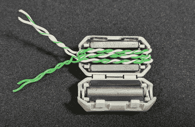

# Raspberry Pi Pico 上的位碰撞以太网

> 原文：<https://hackaday.com/2022/08/26/bit-banged-ethernet-on-the-raspberry-pi-pico/>

虽然 Raspberry Pi RP2040 是一款非常强大的小芯片，但总的来说，与大品牌产品相比，它并没有什么特别之处。但是，PIO 外围设备*有点特别，它的加入显然是一个高瞻远瞩的杰作，因为它赋予了平台所有其他方式很难做到的功能，尤其是价格。*

我们这次的重点是以太网，利用 PIO 作为一个简单的串行器来推出预格式化的比特流。[kingyo]到目前为止已经成功实现了 [Pico-10BASE-T，仅使用少量电阻作为概念验证，提供了最少的 UDP 传输](https://github.com/kingyoPiyo/Pico-10BASE-T) (GitHub 项目)。为了更安全地实现，更常见的做法是磁耦合，虽然现成的器件显然可以实现这一点，但[kingyo]确实展示了一个基本脉冲变压器的结构。为了完整起见，也可以电容耦合以太网硬件(对于初学者来说，这是一个 Micrel 应用程序注释)，但在实践中并没有这么做。

Inside the expedient pulse transformer.

UDP 是传输应用程序数据的简单以太网协议。由于是无连接的，有效载荷数据只是被预先格式化成一个包缓冲区。这一切都很好，直到您意识到对于低成本 uC 而言，数据包相当长，比特率可能相当高，这就是为什么具有专用以太网 MAC 功能的设备具有专门用于该功能的特定硬件串行器-解串行器(SERDES)模块。

与许多小型 uC 设备一样，RP2040 没有内置 MAC 功能，但它有 PIO，可以很容易地编程来执行 SERDES 功能，只需几行代码，尽管目前的运行速度仅为 10 MBit/sec。这将导致现代交换机硬件的一些连接问题，因为它们可能不再支持这种低速，但这很容易通过从易贝获得一些旧的交换机硬件来解决。

至于 UDP 接收，这是未来的承诺，但对于通过有线网络从远程设备获取数据，Pico-10BASE-T 是一个很好的起点。我们以前见过一些利用 PIO 产生高速信号的项目，[如 DVI](https://hackaday.com/2021/02/12/bitbanged-dvi-on-a-raspberry-pi-rp2040-microcontroller/) ，尽管需要大量的超频。如果你想更多地了解 Pico 的所有东西，你可以看看这个[视频系列，我们前阵子重点介绍过这个](https://hackaday.com/2021/07/29/new-video-series-raspberry-pi-pico-and-rp2040-deep-dive-with-uri-shaked/)。