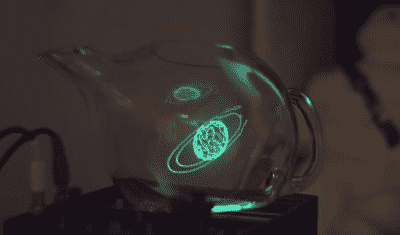

# 混合胡椒的幽灵，合成器和老式电视

> 原文：<https://hackaday.com/2022/05/03/blending-peppers-ghost-synths-and-vintage-tvs/>

我们最近[得到了【约书亚·艾林森】](https://www.notion.so/ellingson/ELLINGSON-Projects-85703cdefc094b1091bfcf263e4cd544)的工作提示，深入研究后，我们发现了大量的艺术收藏和正在进行的实验，合成器变形并驱动老式电视机上播放的旧黑白剪辑，物体从屏幕上跳到现实世界并返回，阴极射线管示波器在空中绘制图形[(声音很大！)](https://twitter.com/ellingson/status/1516182592013307909) [(nitter)](https://nitter.net/ellingson/status/1516182592013307909) 。建议您在继续阅读之前，先看看我们在下面嵌入的简短展示视频，因为将这些视频转录成文字并不能充分体现它们的价值。

如果你不想看视频，我们会试着把它们转录下来。动物、形状和人物出现在现实世界中，由玻璃球和容器绑定，使用被称为 Pepper's Ghost 的技术。用来创造这种幻觉的各种屏幕——有时是平板电脑，有时是倒放在玻璃水族箱上的旧电视机。老式电视机经常出现在[Ellingson]的实验中，通常会播放相应时代的电影场景和片段，甚至被用作的一个地点，一个被小辣椒施了鬼魂魔法的物体可以进入这个地方——这是同一个虚构世界变成现实的一部分。

事情并不总是从电视屏幕移动到它们的玻璃边界，在这个过程中获得额外的维度，但当它发生时，[同步是无可挑剔的](https://www.youtube.com/watch?v=aQRwTC1-2LM)。所有这些都由 Moog 合成器声音支持，通常由 Moog 合成器声音控制，旋钮转动驱动视频失真或物体运动的各个方面。并非他的所有剪辑都有合成器、旧电视或佩珀的幽灵幻觉，但他的每个实验都至少包含这三种中的两种，协调一致地创造印象。艺术价值是不可否认的，[Ellingson]也为我们增加了大量的黑客价值！

【Ellingson】了解如何构建像佩珀的幽灵这样的视错觉——使用各种不同的玻璃器皿，从锥形瓶到茶壶，产生一系列持续不断的新想法，并在其上进行独特的旋转。他的目标是分享和创造超越他的艺术所能实现的东西，这就是为什么他鼓励我们自己去尝试——用这个[一分钟的视频](https://www.youtube.com/watch?v=s7glgzeR1go)快速制作佩珀的幽灵，只使用一个普通的平板电脑，一个空的塑料雪球和一片用于学校投影仪的廉价透明胶片。如果你想超越，他制作了一个广泛的教程,讲述他所做的那种幻觉，它们的简单性和复杂性，以及你可以建立一个幻觉的所有不同方式。

当艺术家发现一种技术并开始使用它时，我们都会受益，从而弥合技术和艺术之间的鸿沟，进而弥合技术和自然之间的鸿沟。有时，它是[流动的光艺术装置](https://hackaday.com/2018/01/01/flowing-light-art-inspired-by-plankton/)，在那里你是浮游生物运动路线上的一块巨石，其他时候，它是通孔组件包装的[印刷电路鸟](https://hackaday.com/2022/01/23/printed-circuit-bird-family-calls-for-us-to-consider-analog/)，它们的歌声与非印刷电路鸟没有什么不同，或者是[操纵 CRT 显示器](https://hackaday.com/2010/11/17/crt-art-wobbulator/)，用函数发生器驱动线圈抵消光束，将图像变成线条图案。

[https://player.vimeo.com/video/554964350](https://player.vimeo.com/video/554964350)

 [https://www.youtube.com/embed/pKCV9PUX42I?version=3&rel=1&showsearch=0&showinfo=1&iv_load_policy=1&fs=1&hl=en-US&autohide=2&wmode=transparent](https://www.youtube.com/embed/pKCV9PUX42I?version=3&rel=1&showsearch=0&showinfo=1&iv_load_policy=1&fs=1&hl=en-US&autohide=2&wmode=transparent)

我们感谢[阿德里安]与我们分享这一点！