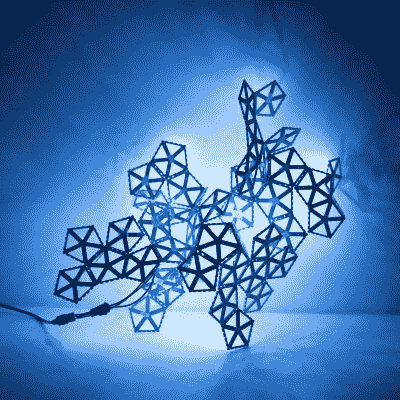

# 眨一次圆周率，赢得一份奖品

> 原文：<https://hackaday.com/2018/08/21/blink-a-pi-win-a-prize/>

你可以插上一个树莓派，你可以让一个 LED 闪烁。你可以将数据可视化，[现在 Hackaday.io](https://hackaday.io/contest/160366-visualize-it-with-pi) 上有一个展示你技能的竞赛。现在，我们将在 Hackaday.io 上开展 Visualize It With Pi 竞赛。挑战？用 LED 条和面板可视化数据。这些“数据”真的只是一段*永远不会放弃你的视频吗？我们很快就会知道了。*

本次比赛的目标是将树莓 Pi 及其巨大的处理能力与 LED 灯条和面板的闪亮优点结合起来，以新颖和艺术的方式可视化和解释数据。我们在寻找动画。清晰度和华丽的闪烁。想要一些想法吗？看看[光之世界](https://hackaday.io/project/11550-world-of-light)或[美国宪法蜡烛](https://hackaday.io/project/7480-american-constitution-candle)。我们正在寻找你能用 Pi 做的最闪亮的东西，是的，会有奖品。

### 奖赏

BlinkyTile Explorers Kit

最佳 blinky 奖当然包括更多 blinky。来自直接连接的传感器的最佳可视化、来自互联网源的数据以及来自深奥数据源的数据都将接收到一些 [Blinkytape](https://shop.blinkinlabs.com/collections/frontpage/products/blinkytape-basic) 。这是一条 WS2812b LEDs，末端嵌入了 ATMega32u4。将 USB 电源插入 Blinkytape，你就可以获得一条你想要的任何颜色的 led，并能够将动画帧推送到条上的芯片上。本次比赛的大奖获得者还将获得 [Blinkytile Explorers Kit](https://shop.blinkinlabs.com/collections/blinkytile/products/blinkytile-exp) ，一条蛇形 LED 灯条，一个 LED 环，以及两米的超薄 LED 灯条。

### 我们开始吧！

竞赛的要求很简单:只要用一个树莓 Pi 驱动 LED 灯条或面板，将其作为一个新项目发布在 [Hackaday.io](http://hackaday.io) 上，并将该项目提交给[竞赛](https://hackaday.io/contest/160366-visualize-it-with-pi)。我们正在寻找一个完整的描述，来源，图表，照片和视频的项目完成版本-尽一切努力展示你的工作！比赛现在开始，将于 10 月 1 日太平洋时间 08:00 结束。我们知道你喜欢闪烁那些发光二极管，所以开始吧。