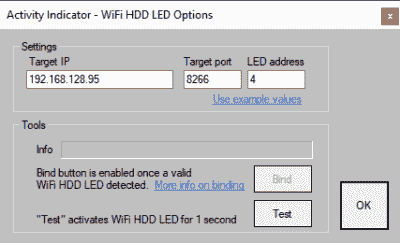

# 物联网上的 LED 闪烁

> 原文：<https://hackaday.com/2019/02/26/blink-an-led-on-the-internet-of-things/>

LED 闪烁通常被认为是经典的“Hello World”项目的硬件等价物。这是一个快速简单的测试，表明你已经完成了基本的工作，也是一个更大更好的事情的起点。那么，在这个辉煌的新物联网时代，它有什么不同呢？

【Limbo】创造的“WiFi HDD LED”本质上就是这样，一个[状态 LED，由于一直受欢迎的 ESP8266](https://www.instructables.com/id/WiFi-HDD-LED/) 的 WiFi 功能，它可以被远程触发。当你的电脑硬盘在颠簸时，你不认为一个闪烁的无线 LED 有多大用处吗？也许不是，但如果你正在寻找一个好方法来涉足 ESP hacking 的世界，这绝对值得一试。

在硬件方面，这正是您所期望的:一个 LED 悬挂在 ESP8266 模块的数字引脚上。如果您使用类似[Limbo]的裸露 ESP-01，由于需要电压调节器，事情会稍微复杂一些，但如果您使用的是更常见的 ESP 开发板之一，则无需添加任何其他东西。事实上，作为概念验证，您甚至可以使用这些板上的内置 LED。

正如你所想象的，这个项目更多的是关于软件而不是硬件。等式两边的代码已经作为开源发布，以满足您的黑客乐趣，并且比您可能期望的更强大。LED 实际上是[Limbo]之前开发的系统活动监视器的扩展，包括一个绑定功能，以确保您正在与右侧闪烁的 ESP 对话。对于许多目的来说，这可能有点过了，但是这是一个很好的例子，说明了如何实现比我们习惯看到的更健壮的 UDP 连接。

这个项目是众多证明实现特定目标不止一种方法的项目之一，而且从最古怪的黑客身上也能学到一些东西。

 [https://www.youtube.com/embed/43siHnJxgmQ?version=3&rel=1&showsearch=0&showinfo=1&iv_load_policy=1&fs=1&hl=en-US&autohide=2&wmode=transparent](https://www.youtube.com/embed/43siHnJxgmQ?version=3&rel=1&showsearch=0&showinfo=1&iv_load_policy=1&fs=1&hl=en-US&autohide=2&wmode=transparent)

