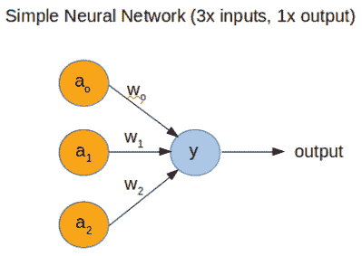

# Arduino Uno 上极快的机器学习

> 原文：<https://hackaday.com/2019/06/30/blisteringly-fast-machine-learning-on-an-arduino-uno/>

尽管机器学习(又称“深度学习”/“人工智能”)已经存在了几十年，但直到最近，计算能力才变得足够快，可以利用科学做任何有用的事情。

然而，为了充分理解神经网络(NN)是如何工作的，[Dimitris Tassopoulos]已经将这个概念简化为最简单的例子[——一个 3 输入 1 输出的网络——并在许多 MCU 上运行推理，包括不起眼的 Arduino Uno。不可思议的是，Uno 以令人印象深刻的 114.4 微秒的快速预测时间处理了网络！](https://www.stupid-projects.com/machine-learning-on-embedded-part-1/)

虽然我们没有在 MCU 上测试代码，但我们碰巧安装了 Jupyter Notebook，所以直接从[Dimitris]的[bit bucket repo 在 Raspberry Pi 上运行相同的代码。](https://bitbucket.org/dimtass/machine-learning-for-embedded/src/master/jupyter_notebook/Simple%20python%20NN.ipynb?viewer=nbviewer)

他在[项目页面](https://www.stupid-projects.com/machine-learning-on-embedded-part-1/)中解释说，现在对人工智能的大肆宣传已经平息了一点，是时候让工程师们了解理论的本质，并开始使用一些“工具”,如 Keras，它们现在已经成熟，成为相当有用的东西。

在项目的第二部分，我们将看到一个更复杂的神经网络的内部结构，它有 3 个输入，一个隐藏层，有 32 个节点和 1 个输出，在 Uno 上以 5600 μsec 的速度运行。

这种在嵌入式世界中对 ML 的探索并不是“高层次”的研究，这种研究往往是难以接近和难以理解的。我们之前已经讨论过类似 Raspberry Pi 和 Arduino 的小平台上的[机器学习，但是没有一个如此简单和彻底实用的例子。](https://hackaday.com/2018/12/25/machine-learning-on-tiny-platforms-like-raspberry-pi-and-arduino/)