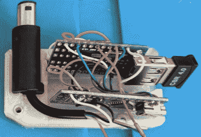

# 蓝牙 PS3 控制器使任天堂 GameCube 现代化

> 原文：<https://hackaday.com/2021/03/29/bluetooth-ps3-controllers-modernize-the-nintendo-gamecube/>

虽然 PlayStation 3 和 Gamecube 来自对立的两方，事实上甚至不是同一代硬件，但这个由[让诺]建造的[DIY 适配器允许任天堂的主机使用索尼的蓝牙控制器](https://github.com/sirjeannot/GamecubeBT),令人惊讶的是没有什么大惊小怪。鉴于任天堂为该系统推出了官方无线控制器，这似乎没有必要，但考虑到它们在二手市场上的价格，你需要有相当雄厚的资金才能进行一次不受限制的四人游戏。此外，有很多人只是喜欢索尼 pad 提供的更传统的控制布局。

3D 打印适配器的内部其实非常简单，只不过是一个 Arduino Nano 连接到 MAX3421E USB 主机保护罩。一个普通的 USB 蓝牙适配器插入屏蔽，外壳有一个开口，所以它可以很容易地交换出来；这很重要，因为这是 PS3 控制器实际配对的对象。

必须牺牲 Gamecube 控制器延长线来提供公连接器，尽管如果你想完全使用蓝牙控制器，看起来你可以很容易地将其转变为内部改造。这样，您就可以直接将控制器端口的焊盘焊接到 PCB 上，从而进一步减少物料清单。

[让诺]表示，固件是结合了一些现有库和大量实验的产品，但正如下面的视频所示，它足以导航控制台的内置菜单系统。未来的增强包括使操纵杆灵敏度更接近 Gamecube 标准控制器的值，并修改代码以适用于较新的 PS4 控制器。

我们已经看到了大量致力于 Gamecube 官方无线控制器 Wavebird 的项目。从[逆向工程其射频通信协议](https://hackaday.com/2017/12/14/reverse-engineering-the-nintendo-wavebird/)到[将其用于任天堂最新的游戏机](https://hackaday.com/2019/04/13/mods-keep-the-wavebird-kicking-in-the-switch-era/)。毫无疑问，Wavebird 是一项优秀的工程，但由于 PlayStation 控制器如此便宜和丰富，当黑客们想要为他们的最新创作提供双棒接口时，他们往往会成为[的首选。](https://hackaday.com/2014/03/03/remote-control-anything-with-a-ps3-controller/)

 [https://www.youtube.com/embed/wYV4qaWRAow?version=3&rel=1&showsearch=0&showinfo=1&iv_load_policy=1&fs=1&hl=en-US&autohide=2&wmode=transparent](https://www.youtube.com/embed/wYV4qaWRAow?version=3&rel=1&showsearch=0&showinfo=1&iv_load_policy=1&fs=1&hl=en-US&autohide=2&wmode=transparent)

