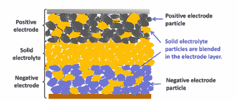

# 宝马大力推进固态电池技术:计划到 2025 年进行演示

> 原文：<https://hackaday.com/2021/04/21/bmw-pushing-hard-for-solid-state-battery-tech-plans-demo-by-2025/>

电动汽车用锂电池领域正在进行大量开发。汽车制造商正在拼命争取每一个小百分比的增长，以增加比竞争对手多几英里的里程，同时努力减少充电时间。

当然，真正的胜利是成功地将更大的、改变游戏规则的电池推向市场。固态电池符合这一要求，有可能提供比传统锂电池更好的性能。宝马认为这项技术有价值，并宣布他们打算在 2025 年展示一款固态电池汽车。

## 固态电池的特别之处是什么？

A diagram of a solid state battery. Instead of gooey liquid or gels acting as the electrolyte, the entire battery would be made of solids instead.

固态电池，顾名思义，用固体材料代替液体电解质。希望通过使用固体电解质，[多种因素将实现传统设计无法实现的性能增益](https://www.researchgate.net/figure/Schematic-diagram-of-an-all-solid-state-battery_fig2_327379494)。一个主要的兴趣领域是固态电池是否[允许使用锂金属阳极的可能性，这将提供更高的能量密度](https://news.mit.edu/2020/solid-batteries-lithium-metal-electrode-0203)，比当前设计的能量密度大 2 到 3 倍。这将允许更长的范围，或简单地比目前的现状更轻的电池。液态电解质也是当前锂电池高度易燃的原因。用易燃性较低的固体化合物代替它们，电动汽车可能会更安全。电池还可以在更高的温度下运行，风险更小，减少了冷却需求，并有可能实现更高的性能和更快的充电时间。

然而，固态电池的成功仍然难以捉摸。障碍无处不在，因为研究人员试图找到材料和设计的神奇组合，以生产出能量密度更高的电池，可以在要求苛刻的汽车环境中应对。目前的概念验证设备在多方面都存在问题。在充电和放电循环过程中，固体电解质的尺寸会发生变化，从而导致损坏和破裂，或者与其他电池组件接触不良，从而导致性能下降。纸面上更高的数字是不够的；一个市场上现成的固态电池需要符合每一个条件，在十年或更长的时间里，要比它的前辈更可靠。

## 就在菲斯克出手相救的时候，宝马也加入进来了

对于一些人来说，斗争太多了，早期的支持者 Fisker 最近宣布他们已经放弃了一项他们曾经希望在 2018 年发布的技术。然而，其他汽车制造商仍然在这场游戏中，[包括大众，他们正在与 QuantumScape 合作，最后期限是 2024 年](https://www.theverge.com/2020/12/8/22158573/quantumscape-solid-state-battery-ev-range-charge-vw)—[最近与菲斯克就技术](https://www.theverge.com/2021/2/25/21355123/fisker-quantumscape-lawsuit-trade-secret-solid-state-batteries-fsr-qs)达成了和解。不要被排除在外，[丰田也在投资研究。显然，这个行业上下都在进行四维象棋游戏，这暗示了在这个领域取得成功的潜在价值。](https://asia.nikkei.com/Spotlight/Most-read-in-2020/Toyota-s-game-changing-solid-state-battery-en-route-for-2021-debut)

BMW have invested heavily into EV technologies, bringing several vehicles to market. Future BMW EVs are hopefully as daring as existing models like the i8.

宝马正在努力实现类似的时间表，希望到 2025 年有一个技术演示。如果过去的宝马概念、[甚至它们的电动公路车有什么值得一提的话，那就期待一个充满狂野和可能不切实际的造型特征的未来愿景吧。该公司预计，这项技术在此后的一段时间内不会投入生产，预计模型将在 2030 年左右推出。这个时间尺度对于新的汽车技术来说并不罕见。它为宝马提供了多年的长期测试，以确定新电池在所有条件下的性能——从北极寒冷到沙漠炎热。汽车制造商通常为普通车辆投入数百万英里的研发资金，试图解决问题；moonshot 电池技术在发射前需要同样严格的关注。](https://www.caradvice.com.au/834765/bmw-i8-production-ending/#:~:text=Available%20in%20a%20coupe%20and,popular%20following%20its%202014%20release.)

虽然这一宣布令人兴奋，是固态电池未来的积极迹象，但我们很可能在未来 5 到 10 年内不会在现实世界中看到太多东西。然而，如果固态电池的研究真的成功，而且技术符合要求，那么一旦生产线达到速度，预计他们会很快清理出房子。