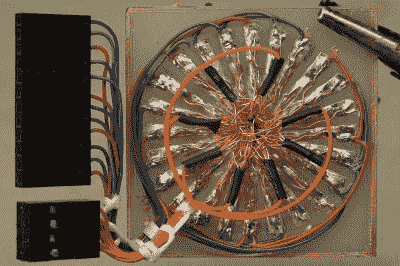

# 盆景 LED 矩阵有混乱的根源

> 原文：<https://hackaday.com/2020/10/21/bonsai-led-matrix-has-chaotic-roots/>

如今，大多数人不会手工焊接他们的表面贴装 LED 矩阵，他们肯定不会用 RGB LEDs 来焊接。与大多数人不同，[成功地将他的电子爱好发展成了被称为盆景的艺术形式。](https://25120.org/post/laurelin/)

 几十年来生长的微型树木的有机形状是耐心和毅力的终极指标。对于那些喜欢随心所欲地弯曲铜而不是树苗的人来说，生产一棵外观和功能都如此出色的 LED 树是一项成就，标志着巧妙的规划和耐心的制造。这部动画作品是一部耗时 18 个月完成的杰作。

有 128 根漆包线缠绕成分支，支撑着 32 个 RGB 发光二极管。通过巧妙设计的电路板，在树的底部接入每一个都是一片混乱。

一个圆形的花瓣图案被放置在 Inkscape 中，包括一个在中心的洞，供“树干”通过。LED 矩阵设计为 8 行 12 列，但布置了 24 个焊盘，因此每个铜瓣只需焊接四根导线。即便如此，看看支撑 PCB 的鳄鱼夹就知道这项工作的规模了！

棱角分明的底座本身由覆铜板制成，焊接在接缝内侧，外部涂成黑色。这隐藏了“花瓣”PCB，以及 STM32 微控制器的分线板和电源管理电路，允许您选择 USB 或锂电池。

我们想知道[fruchti]是否想过为他的树苗增加一些互动性。虽然我们还没有见过如此美丽、小巧的作品，但我们见过[一棵 LED 树，它的灯光可以像生日蜡烛一样被吹灭。这难道不是我们](https://hackaday.com/2019/12/11/a-tree-of-leds-that-blows-out-like-a-candle/)[赛车场雕塑挑战赛](https://hackaday.io/contest/174093-2020-circuit-sculpture-challenge)的绝佳参赛作品吗？还有几个星期呢！