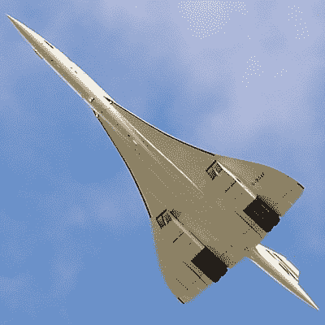
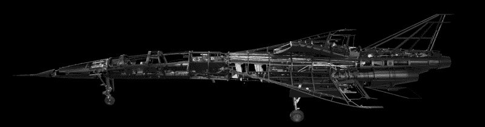
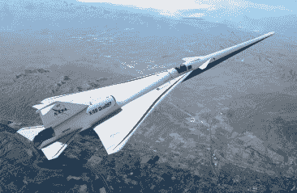
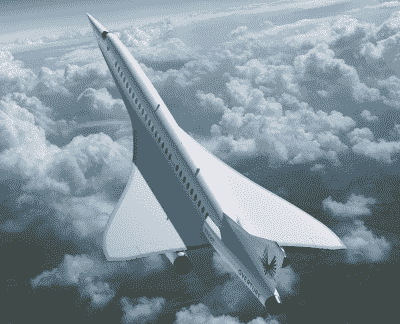

# Boom 希望用 XB 1 号重新点燃超音速旅行

> 原文：<https://hackaday.com/2020/08/10/boom-hopes-to-reignite-supersonic-travel-with-xb-1/>

自从 2003 年最后一架协和式飞机停止运行以来，超音速飞行几乎只限于军用飞机。许多人认为，这是我们的文明似乎在技术规模上倒退的一个例子，类似于回到航海时代。毫无疑问，我们有能力以超过 1 马赫的速度安全地运送民用乘客和货物，这只是一件不再做的事情。

Concorde on its final flight, November 2003

当然，公平地说，天空中没有超音速飞机的原因有很多。首先，它们的建造和运营成本历来比速度较慢的同行要高得多。能够在超音速下长时间运行的飞机的工程设计并不便宜，所需的材料也不便宜。但是很自然的，商用喷气式飞机也曾有过同样的经历。随着进一步的发展，成本最终会降下来。

阻碍超音速飞机发展的真正问题要实际得多:它们太吵了。从起飞时大功率发动机的轰鸣声，到它们身后留下的令人吃惊、有时甚至危险的“音爆”，没有人希望它们飞过自己的家园或社区。事实上，自 1973 年以来，根据联邦航空管理局的条例 91.817，在美国，超过 1 马赫的地面民用飞行已经被宣布为非法。

对于任何可行的商用超音速飞机来说，它不仅需要比旧设计的建造和运营成本低得多，而且还需要安静得多。这正是 Boom 希望用他们的 XB-1 原型展示的东西。这种光滑的飞行器本身永远不会进入商业服务，但如果在 2021 年的试飞中一切按计划进行，它可能会证明飞机设计的最先进水平已经准备好迎来超音速民用运输的新时代。

## 站在巨人的肩上

20 世纪 60 年代早期设计协和式飞机时，商用喷气式飞机还是一个相对较新的概念。它代表了一个技术上的巨大飞跃，并且与军用研究飞机相比，它与任何搭载付费乘客的飞机有更多的共同点。许多核心部件，如奥林巴斯 593 发动机，必须为协和式飞机量身定制。这使得这种飞机的开发和制造异常昂贵，虽然估计相差很大，但最终该计划被认为花费了近 100 亿美元。

但 XB 1 号的情况并非如此。Boom 认为，许多核心技术对商用超音速飞机的成功至关重要，比如碳纤维机身，这些技术已经得到了很好的理解。像几乎所有的现代飞机一样，XB-1 的设计也极大地受益于计算流体力学的进步。以前可能需要几年时间的物理测试现在可以在计算机上用很短的时间模拟出来。

另一个巨大的好处是使用现有的发动机，通用电气 J85。它最初是在 20 世纪 50 年代为美国空军设计的，当然不是新发动机。但是它已经经历了几次修改，以提高其性能和效率，预计至少在未来几十年内仍将服役。

## 熟悉的面孔

XB 1 号与美国国家航空航天局的 X-59 安静超音速技术(QueSST)飞机有着惊人的相似之处，这并非巧合。虽然 Boom 一直对他们的飞机最终会有多安静持相对谨慎的态度，但即使粗略地看一眼，也可以清楚地看到，他们已经采用了一些美国宇航局和 X-59 主承包商洛克希德·马丁公司认为将有助于减轻他们的实验飞机产生的音爆的设计元素。

  Boom XB-1  NASA X-59 QueSST

这两种飞机都利用细长的机身来防止前后压力波压缩在一起并产生高能冲击波。地面上的观察者将听到一连串沉闷的撞击声，而不是这些波浪相互撞击的巨大声音。虽然这并没有完全解决问题，但它应该会将传统的音爆降低到只会融入城市环境中正常生活背景噪音的程度。

也就是说，XB-1 显然没有把这个概念发展到 X-59 那么远。Boom 最终希望创造一种实用的商用飞机，而 NASA 正在研究这项技术的极限。X-59 上几乎滑稽的长机头延伸肯定会给 NASA 提供大量关于音爆消除的数据，但可能不会成为未来飞机的标准特征。

## 开业

 Boom 称,“XB 一号”的建造将于今年年底基本完成，飞行测试将于 2021 年开始。这恰好是美国宇航局和洛克希德·马丁公司计划开始 X-59 飞行测试的时候。当然，假设这两个项目都没有被全球新冠肺炎疫情 T4 严重延迟。

但对 Boom 来说，XB 1 号的成功测试仅仅是个开始。在较小的飞行器上验证了他们的核心技术和设计原则后，该公司表示，他们将立即开始建造一架他们称为 Overture 的 2.2 马赫的客机。

这架 52 米(170 英尺)长的飞机最多可以搭载 55 名乘客，用于高速国际商务航班。尽管它预计会比同样大小的协和式飞机安静得多，但 Boom 设想序曲主要在噪音不会成为问题的越洋航线上飞行。虽然时间表显然取决于 XB 1 号的表现，但 Boom 希望序曲能在 2027 年投入服务。