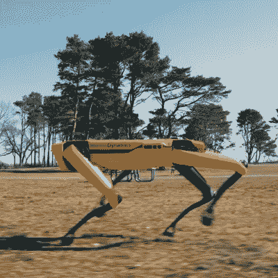

# 波士顿动力公司的侦察机器人标价:7.5 万美元

> 原文：<https://hackaday.com/2020/06/18/boston-dynamics-spot-robot-gets-a-price-tag/>

One of Spot’s features is the ability to navigate real-world environments. This has not historically been a strong point for robots.

不久前，波士顿动力公司的 Spot [终于上市销售](https://shop.bostondynamics.com/)，这意味着现在可以在网上购买这种像狗一样的机器人。以前，它只能被愿意付费的早期用户租用，看看机器人能提供什么。定价藏在 NDA 背后，Spot 只能租赁，不能实际购买——直到现在。

从业余爱好者的角度来看，Spot 的价格当然令人眼馋；配件的成本更是如此。问一个问题是完全可以理解的:[机器狗](https://hackaday.com/2019/09/25/ask-hackaday-what-good-is-a-robot-dog/)有什么好，是什么让它值这么多钱？

从工业设备的角度来看，成本可能没那么令人震惊。也许这是一个提醒，从工业和商业的角度来看，一个东西的价格主要关系到它能带来什么样的利益，以及它能带来什么样的价格或节约。

黑客就是黑客，不用担心这些事情，有些人选择自己制作四条腿的机器人朋友，而不需要彩票中奖、丰厚的补助金或庞大的研发预算。