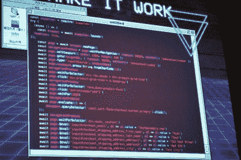

# 在破坏商业社会信任的同时阻碍最热门时尚的机器人

> 原文：<https://hackaday.com/2019/08/10/bots-that-snag-the-hottest-fashion-while-breaking-social-trust-in-commerce/>

互联网上的稀缺是机器人作家的迷人歌曲。也许你在过去的几毫秒里输掉了一场易贝竞标，或者错过了一场门票在一分钟内售罄的黑客骗局——你的有形自我被一个机器人超越了。但也许你不知道，机器人正在被炒作的时尚界掀起购买狂潮。从限量版运动鞋到任何印有单词 *Supreme* 的东西，不接受任何替代品穿着最稀有和最受欢迎的人正在转向经销商，他们使用机器人来抓取 unobtanium 物品并在二级市场上获利。

在 DEF CON 27 [ [FinalPhoenix](https://twitter.com/finalphoenix) ]上台分享了她编写机器人的冒险经历，并揭示了一个买卖采购自动化的世界，组建了类似加密货币挖掘池的小组，以在最新时尚即将过时时产生线索。这也不是一个小市场。如果你的机器人足够聪明，你可以赚很多钱。让我们看看写一个机器人需要什么，以及围绕这些概念发展起来的待售机器人经济。

互联网是在考虑机器人的情况下建立起来的，为此我们要感谢谷歌。他们的主要创新是将我们从一个策划的互联网转移到一个机器抓取的互联网。每个人都想要好的谷歌果汁，这意味着建立一个对搜索和索引互联网的谷歌机器人友好的网站。这使得您自己的自动化变得更加容易。即用于检测零售商何时有货的监控机器人。[FinalPhoenix]演示了一个简单的脚本，它获取 XML 站点地图，解析它寻找新的库存商品，找到后标记它们。但这里有一个杀手——如果你的监控机器人是一个好的，你可以把它变成一个不和谐的频道，并向其他玩经销商游戏的人出售订阅，每个订阅者每月 15-30 美元。

Example slide of code used in a web-based buy-bot

一旦你的机器人报告了股票，你就会抢在别人之前买下它。为此，你可以使用该网站的 API，但这很耗时，而且零售商更容易检测和阻止机器人的使用。对于这部分的装瓶工具，[FinalPhoenix]喜欢使用基于网络的机器人，它们通过 Chromium 这样的浏览器框架，允许模糊技术，如滚动、点击其他项目、随机暂停和其他简单的动作，使你的机器人看起来像人类一样。在这个演讲的例子中，[木偶框架](https://pptr.dev)被用于这个目的。最后，这部分机器人的主要作用是使用一个经过验证的帐户，以尽可能快的机器人速度完成购买，这就是为什么它们被称为购买机器人。零售商确实有一些技巧来对抗这些基于 web 的攻击，例如在 DOM 中添加需要在下一篇文章中发送的密钥，但这些很容易被发现并合并到脚本中。

这引出了该方案的另一个有趣的部分，验证账户。为了获得最大利润，你需要多个账户，每个账户只使用一次，以避免你的购买机器人被零售商发现。为此，[FinalPHoenix]求助于以 500-10，000 个账户为一组出售账户的服务，每批价格仅为 5-10 美元。

但是等一下，随着递归的出现，这里变得非常疯狂。是的，这些购买机器人是出售的(来自像 AIO 机器人这样的网站，通常大约 300-1500 美元)，但是它们的销售数量有限，所以零售商很难注意到并采取对策。就像这些衣服是如何被限量发行并激励使用机器人的经销商进入市场一样，机器人本身也有一个二级市场。[FinalPhoenix]报道称，转售其中一个机器人可以获得 1000-1500 美元的利润。同样的原则也适用，所以我们最后得到的是机器人买机器人买衣服。谁知道有多少级别的 bot-bot 交易，但它肯定感觉像一路向下的海龟。

基于 Bot 的高速交易才是真正让各大银行走上证券市场的途径。普通黑客被“合法”的生意拒之门外，但是任何有进取心的程序员都可以选择自动化他们最感兴趣的经销商市场。这打破了公众对商业的信任——以合理的价格从与其生产相关的卖家那里购买优质产品。如果让制造商沮丧，疏远消费者，但似乎没有什么地方可以阻止它。