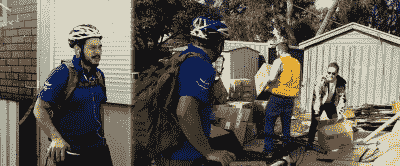
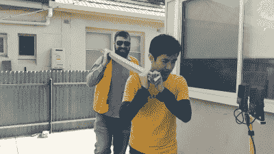
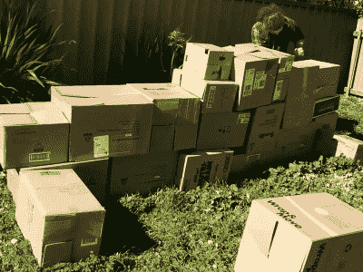
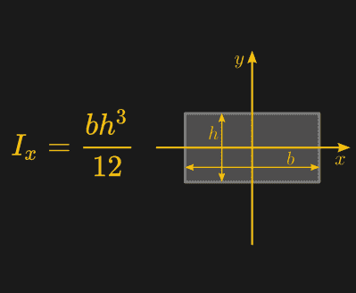
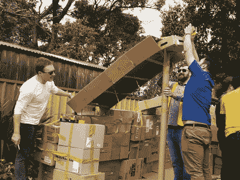

# 成年人的箱式堡垒:最佳实践和设计策略

> 原文：<https://hackaday.com/2018/09/24/box-forts-for-adults-best-practices-and-design-strategies/>

许多成年人可以回忆起他们年轻时建造的各种建筑奇迹。堡垒，不管是基于箱子还是毯子，都是当时的流行，也是度过一个多雨的周日下午的绝佳方式。

碰巧的是，一旦一个人达到成年年龄，没有法律禁止扩大这种活动。然而，在这个层次上构建一个结构需要一些仔细的计划和考虑，这也是我们今天这篇文章的目的。

## 位置，位置，位置

To avoid an awkward conflict, be sure to warn your housemates of impending construction well ahead of time.

开始构建时，首先要考虑的应该是您希望在哪个领域进行构建。室内建筑有避开天气的优势，然而坚硬的地板会导致爬行时膝盖酸痛。此外，你现在已经长大了，所以你的同龄人听到你坐在客厅的一个盒子里不太可能会留下深刻印象。

不，如果你想做好这件事，你应该去外面。平坦的草坪最好，提供柔软的地面和足够的空间。大自然的挑战将指导你的工作——当你舒适干燥地坐在纸板房子里，听着雨点打在屋顶上的声音，你会感到更加满足。当你建造的东西可以在恶劣的户外生存下来时，会有一种真正的成就感，此外，风景也更好。

## 材料

很明显，要建造一个箱形堡垒，你需要箱子，现在你不再是三英尺高了，你需要很多箱子。如果你在比特币市场上发了大财，你很幸运——向你当地的包装公司订购你需要的数量，你就万事俱备了。然而，对于我们其他人来说，有很多方法可以搜集资料。

简单的事实是，零售业经历了大量的包装——真的。诀窍是知道去哪里找。就澳大利亚而言，大型超市在很大程度上是浪费时间，因为箱子几乎会立即被压碎，一旦使用过就会被回收。然而，规模较小的超市，尤其是那些更注重社区的超市，往往更乐意将一些夜间灌装的剩菜放在一边。它们是中小型常规包装盒的重要来源。

不过，理想的情况是，你想要你能得到的最大的盒子。这就是五金店和家具店的用武之地。数量很少，所以它们通常被手动展平和处理，这意味着如果你愿意出现并带走它们，它们通常是可用的。

L-angle is rigid and strong, making it invaluable for construction purposes.

然而，扁平的纸箱并不是最重要的。当你在建造一个先进的结构时，你需要能够承受一定负荷的横梁。这是你需要寻找硬纸板 L 形角，甚至硬纸板地毯管的地方。这些部分具有很高的强度，在搭建屋顶时非常有价值。

这里真正的诀窍其实是沟通。你需要能够识别谁有你想要的东西，然后联系他们，看看你是否能捡起他们的废纸板。这通常很简单，拿起电话，礼貌地解释说你正在做一个项目，很乐意捡起他们扔掉的多余的盒子。一般来说，人们都非常愿意帮忙，如果不愿意，没问题！总有别的地方可以尝试。

除了纸板，你还需要一样东西——一大堆胶带。无论你认为你需要多少，翻两番。相信我。

## 建筑技术

A no-nonsense foreman will help keep your builders motivated.

你已经走出去了，今天天气很好，你的朋友们随时都会来。你如何将这堆笨重的纸板变成一座你可以引以为豪的建筑？

第一步是计划。在你的头脑中得到一个你想要做的事情的粗略想法——多少个房间，秘密隧道，等等。然后开始摆放你的箱子来建造围墙。进去走动一下，看看尺寸是否合适。重要的是在一开始就把这一点做好，这样你就不会在一个拥挤、不舒服的地方结束，你的朋友也不想在那里玩。

通常，如果您正在处理各种不同形状和大小的盒子，最好的方法是使用折叠状态的盒子，而不是扁平的纸板。使用平纸板可以给人一种非常干净的感觉，但这样的设计需要很多横梁，比如 L 形或其他形状的，来支撑墙壁。考虑到这种材料很难获得，建造箱式建筑通常更容易获得，并且给人一种典型的箱式堡垒的感觉。

Overlapping boxes in each new layer in the wall helps hold things together.

交错摆放盒子很重要——墙内较高层的盒子与下面的盒子重叠。这有助于将墙壁锁在一起，使其结构更具弹性。如果你想要快速而肮脏的构建，这种技术，结合大量的胶带，通常就足够了。然而，如果你想变得新奇，或者你正在一个大风地区建造房屋，你可能要考虑一些更先进的砌砖技术。另一个有用的主意是在你的墙根处放下箱子。这作为一个坚固的基础，使你的箱子不太可能在你的堡垒的居民弹跳时滑动。

地板是一个领域，你的想象力真的是极限。如果你有一个很棒的草坪，你可能根本不需要地板！或者，防水油布或各种类型的油毡片可用于耐磨表面。然而，承担了这个项目后，你可能会发现自己有大量的硬纸板。扁平盒是一种非常便宜的地板解决方案，你可能已经准备好了所有需要的材料。

屋顶通常是事情变得复杂的地方。是的，露天堡垒可能很有趣，但它缺乏一定的舒适性和隐私性，这是没有天花板就无法获得的。如果你已经把你的堡垒建造到合适的成人尺寸，你会发现如果你要从上面封闭东西，你有相当长的距离来跨越你的墙壁。

这就是工程学的用武之地。如果你试图简单地将平板放在一个很宽的缝隙中，它们会在中间下垂。他们需要支持。这里要考虑的是你的屋顶结构的变形。对于简单的矩形梁，下面的公式用于计算面积的二阶矩。

Calculating the second moment of area for a rectangular beam. Source: Wikipedia

在这方面，面积的二阶矩是非常重要的；更高的面积二阶矩意味着你的梁将更好地抵抗偏转。一个较低的面积二阶矩意味着你的光束将根本无法支撑。注意等式中的各项——b 代表底部宽度，h 代表高度。高度项是立方的，这意味着梁的高度在刚度方面起着更大的作用。

这就是为什么工字梁和 C 型梁在建筑中如此普遍的原因——它们在垂直平面上具有极好的刚性，因此可以很好地分散载荷。显然，计算变得更加复杂，但关键是，当谈到抵抗垂直偏转的刚度时，高度总是更重要。

为了以一种简单的方式形象化这一点，拿一把钢尺，把它挂在桌子的边缘。平放时，只需很小的力就能使尺子偏转。然而，把尺子立在它的边缘，它会非常坚硬，需要巨大的力量才能偏转！

这对你这个有事业心的 box fort 工程师意味着什么？很简单——对于你的屋顶跨度，重要的是创建具有高面积二阶矩的梁，以便它们支撑屋顶。这可以很容易地通过使用纸板 L 形角或辊来实现，但这可能很难获得适合屋顶梁的长长度。

Making C-beams out of flat boxes is a great technique for building roof structures.

一个很好的替代方法是用现有的箱子制作你自己的 C 型梁。如图所示，扁平盒子的侧面折叠起来形成 C 形横截面。为了阻止它们展开，胶带被用作张力撑条来保持横梁的形状。在我最近的建筑中，这些与垂直的柱子结合在一起，形成了一个有着美丽的高天花板的尖顶屋顶。通过用松软的硬纸板制造刚性梁，你有能力建造更大胆、更有弹性的结构——你的创造力真的是极限了。

一旦横梁就位，你只需要盖上屋顶。垃圾袋是一种选择——它们噪音很大，但是很好的阻挡了雨水，同时也让大量的自然光进来。不过，理想情况下，你会有足够的平纸板来覆盖整个结构。这可能很难在适当的位置录音，并且需要你小心翼翼地靠在墙上，但它可以给出一些奇妙的结果。

## 最终注释

After a long day on the job, it’s always nice to kick back with a cold, frosty beverage and the company of a few good friends.

你现在是个成年人了，但有些事情永远不会改变。毯子、豆袋和枕头应该是你装饰城堡的首选。但它不必就此停止！我们在这里都是黑客，所以如果你没有过度使用各种闪烁的 led 和 Arduino 供电的发明，那就是失职了。作为一个公认的临时建筑，你可以自由地为危险的对讲机装置或最新的数码相框搭建墙壁。如果您复制了

当然是企业号星舰的整个舰桥。

总的来说，有一群好朋友，再加上足够的努力，你可以建造一个远远超出你童年最疯狂梦想的箱形堡垒。前进并创造，在评论中分享你最好的技巧！

 [https://www.youtube.com/embed/1kmBH15_YY4?version=3&rel=1&showsearch=0&showinfo=1&iv_load_policy=1&fs=1&hl=en-US&autohide=2&wmode=transparent](https://www.youtube.com/embed/1kmBH15_YY4?version=3&rel=1&showsearch=0&showinfo=1&iv_load_policy=1&fs=1&hl=en-US&autohide=2&wmode=transparent)

