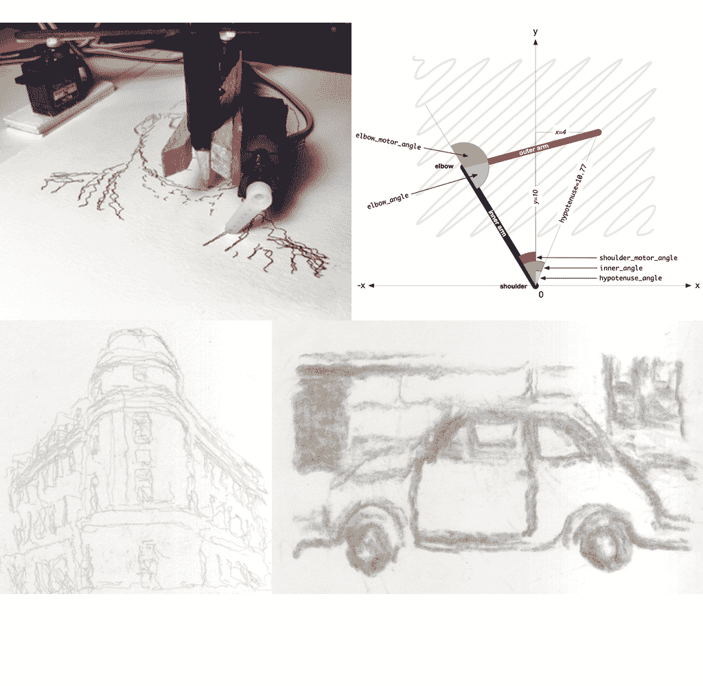

# branchiograph:一种简单廉价的笔式绘图仪

> 原文：<https://hackaday.com/2019/10/30/brachiograph-a-simple-and-cheap-pen-plotter/>

[BrachiGraph 项目](https://brachiograph.readthedocs.io/en/latest/)由两部分组成，伺服驱动绘图臂(笔式绘图仪)的硬件设计和软件实用程序(用 Python 编写),软件实用程序允许控制绘图臂的伺服系统，以便将位图图像转换成可用于绘制各种风格的类似原始图像的线条集合。制作你自己的版本[所需的所有软件和设计都可以在该项目的 Github 页面](https://github.com/evildmp/BrachioGraph)上找到。

考虑到估计€14 价值的项目材料，产生的结果是惊人的，即使项目背后的原则可以追溯到古希腊，当然。基本硬件是一个[缩放仪](https://en.wikipedia.org/wiki/Pantograph)，它为如何驱动绘图仪臂上的伺服系统提供了基本线索。

这里的主要成就无疑是极简主义，三个非常便宜的 SG-90 microservos，一些木头，一个衣夹或等效物，当然还有一支笔，提供了一个功能绘图仪，任何人都可以在一个缓慢的周日下午从车间周围的随机碎片中组装起来。