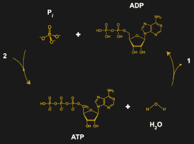
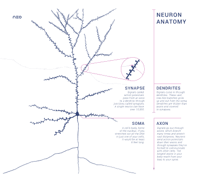
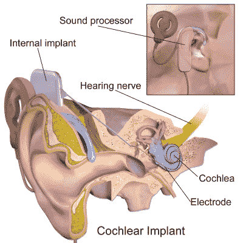
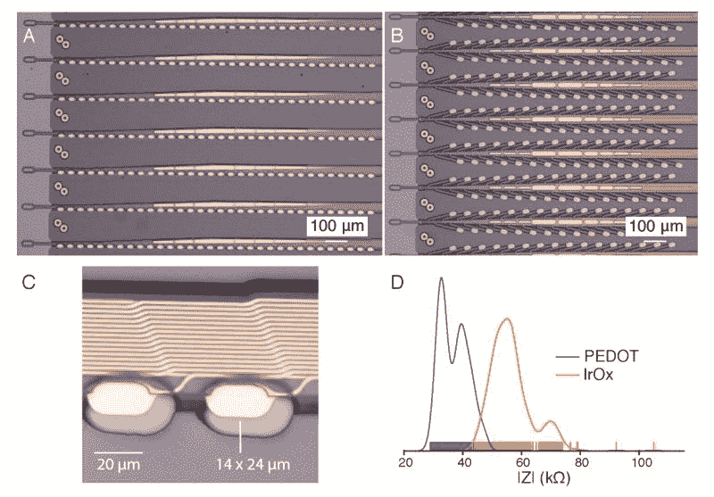
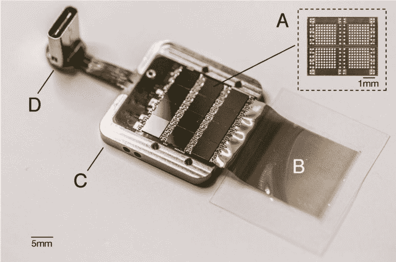
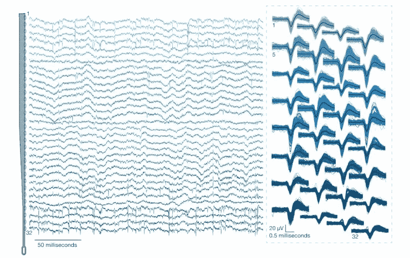

# 脑机接口:从马斯克的大脑植入声明中分离事实与虚构

> 原文：<https://hackaday.com/2019/07/24/brain-computer-interfaces-separating-fact-from-fiction-on-musks-brain-implant-claims/>

当谈到像脑机接口(BCI)这样听起来像未来主义的东西时，我们的集体思维往往会直奔无数电影、漫画和其他科幻作品中的场景(包括更多反乌托邦场景)。我们的脑海中充满了一切，从《星际迷航》中的博格人和神经接口到《T2》中的带有父母控制阻断功能的神经记录设备，当然还有《黑客帝国》中的机器对人类的奴役。

现在有一个叫埃隆·马斯克的家伙，宣布他将从明年开始把人的大脑连接到电脑上，作为他的另一家公司 Neuralink 的一部分。在这里，承诺和想象真正直接来自科幻领域，从“阅读和写作”到大脑，治疗大脑疾病，并将人类思维与人工智能相结合。这其中有多少只是投资者的言论？请加入我们，看看脑机接口、神经假体以及我们对这些技术在未来几年的预期。

## 如何与生物化学相结合

The ATP-ADP cycle: ATP degrading into ADP releases the energy stored in the bond of the final phosphate. Adding energy synthesizes a new ATP molecule.

让计算机和其他设备与组成我们身体的生化结构相结合如此困难的主要问题是它们根本不同。我们的设备(通常)由电力驱动，而我们的细胞使用 ATP ( [三磷酸腺苷](https://en.wikipedia.org/wiki/Adenosine_triphosphate) )。我们新陈代谢的大部分目标是制造更多的 ATP，用于我们身体内的任何过程。由于我们的电子设备本质上不是生化的，它们本质上讲的是一种不同的语言。

Anatomically correct pyramidal neuron, the dominant neuron type in the cerebral cortex.

神经细胞([神经元](https://en.wikipedia.org/wiki/Neuron))是一种有趣的细胞类型，因为它们已经进化出使用离子产生的动作电位将信号沿着细胞体(轴突和树突)的副产物传递给其他神经元的能力，这些信号位于称为突触的位置，在那里使用称为神经递质的特殊化学物质发生化学信号([神经传递](https://en.wikipedia.org/wiki/Neurotransmission))。对我们来说幸运的是，这是一种信号，我们*可以*用我们的电子设备黑进去。

许多 BCI 和神经修复技术都围绕着记录大脑中枢神经系统(CNS)和周围神经系统中神经元的这些动作电位。使用导电探针，我们可以测量产生的电压，充分放大非常微弱的信号，使之可用。

## 修补新零件——我们以前做过

神经假体领域已经存在很长时间了，1964 年在斯坦福大学，第一个[人工耳蜗](https://en.wikipedia.org/wiki/Cochlear_implant)被植入病人体内。毫无疑问，这些装置是神经假体装置中最成功的例子。成千上万的人被植入病人体内，很大程度上恢复了听力。对于每一个成功植入人工耳蜗的人来说，这是一件改变生活的事情，很明显，我们应该寻找这项技术的其他方式来帮助那些需要帮助的人。

这些设备相当简单:它们有许多捕捉环境声音的麦克风。该信号由 DSP 芯片处理，转换成适合该装置植入部分的信号。该信号通过感应耦合传输到内部植入物，并用于刺激耳蜗神经，然后患者感知为声音。

然而，称神经假体为“BCI”可能有些不准确。神经假体的目标不是在计算机系统和大脑之间建立通信，而仅仅是恢复失去的功能，如听觉、视觉、功能性手臂或腿，或者桥接截瘫患者脊髓的受损部分。在这个路径中存在计算机系统(像耳蜗植入物中的 DSP)仅仅是为了实现这个功能，而不是作为最终目标。

BCI 是一个更广阔的领域，有许多实验项目和基础研究，远远超出了这些实际的实现。

## 这一点都不会痛:Neuralink 的植入技术

脑-机接口主要涉及截取来自大脑神经元的信号，以便绘制和理解信号。为了做到这一点，探针必须尽可能地靠近要监测区域的神经元。三种方法是可行的:

*   非侵入性:皮肤没有被破坏，纯粹的外部测量。
*   部分侵入式:该设备被放置在大脑本身的顶部，在颅骨内，在[硬脑膜](https://en.wikipedia.org/wiki/Dura_mater)的下面。
*   侵入式:该装置直接植入脑组织。

显然，侵入式方法将产生最佳结果，因为测量是在尽可能靠近神经元的地方进行的，允许传感器系统区分小神经元组，而不是对数千个神经元或更多神经元组进行平均。这也是 Neuralink 在不同探针上的工作背后的推理，其细节在他们最近发表的论文中分享。

Neuralink’s ‘thread’ sensor design with probes along the length. (credit: Neuralink)

Neuralink 开发了所谓的“线”，沿长度方向包含几十个单独的触点，每条线引用 32 个触点。通过将这种线插入目标区域的灰质，他们从不同深度的整个长度的神经元上获得读数。这些线程连接到执行实际采样的设备。目前，它只在老鼠身上进行了测试，让动物在实验中存活下来是次要问题。因此，它从动物的头骨中伸出来(照片发表在 Neuralink 的论文中，为了不那么神经质)，带有一个 USB-C 端口，便于数据访问和电力传输。

This is the device that currently has to go into your noggin to make the threads work. (credit: Neuralink)

假设 Neuralink 可以缩小设备，使其能够轻松地插入一个人的头骨，并使其无线化，这种侵入式程序将允许从大脑内数百到数千个位置进行读取。如果像 Neuralink 官员建议的那样用几十到几百个线程来实现，那么人们将获得几千到几万个读数。

接下来最紧迫的问题当然是，这些读数有多大用处？

## 理解这些数据非常非常困难

无论你如何收集数据，是通过外部脑电图(EEG)还是使用侵入式传感器，信号都必须经过处理才能决定大脑在做什么。峰值表示一个或多个神经元经历了动作电位，该动作电位被附近的探针拾取。然后以一种特定的方式解释它，这种方式考虑了大脑中的位置。例如，如果它在运动皮层，那么它可能意味着这个人想到了移动他们的手臂。

这里的主要问题是，尽管我们根据以前的实验(以及在事故中遭受脑损伤的人，如著名的菲尼亚斯·盖奇的[案例)对大脑中特定功能的位置有一个粗略的想法，但仍然有很多我们不知道的。当从一个人转移到另一个人时，这变得非常复杂。人类并不是彼此完美的碳拷贝，我们的大脑也在不断改变自己的确切布局。功能定位很棘手。](https://en.wikipedia.org/wiki/Phineas_Gage)

The recorded data with the cleaned-up version on the right from 32 contacts embedded in the brain of a rat. (credit: Neuralink)

世界各地大学的研究团队一直试图绘制那些在接受手术时或作为癫痫治疗的一部分在大脑中植入电极的人所说的话。《T2 科学》杂志的文章显示，研究人员发现这项任务远非易事。即使他们能够在侵入性监测大脑活动的过程中听到人们在说什么，试图解码大脑信号也只能达到 40%到 80%的准确率。

如果没有这样长时间的训练——比如当一个人完全不能说话的时候——几乎不可能将这些发声映射到特定的大脑模式。这也是因为语言不仅仅是由大脑的一个单一部分产生的，而是分布在整个大脑中，从运动皮层到语言中枢，再到参与语言规划的各个部分。

从本质上说，我们仍然只是刚刚开始弄清楚需要什么来理解这些信号，这些信号是我们从嵌入动物和我们自己大脑中的探针接收到的。我们已经可以通过训练和校准做出惊人的事情，但我们显然还没有接近我们在科幻小说中看到的脑机接口类型。

## 炒作和科学的区别

不幸的是，我们对人脑的了解相当有限。尽管我们对神经元如何工作以及它们如何组合成更大的网络有了基本的了解，但直到最近我们才开始发现构成例如大脑外部([大脑皮层](https://en.wikipedia.org/wiki/Cerebral_cortex))的网络结构，语言和意识的高级功能被认为起源于大脑外部。

仅大脑皮层就有 140 亿到 160 亿个神经元。假设我们只是将 BCI 的努力集中在大脑的这一部分，仍然有很多神经元需要监测。相对于 Neuralink 的探针，规模差异应该很明显，我们在这一点上所能做的就是监控神经元群，试图整合和解释它们的集体活动。

这就是人们可以客观地说 Neuralink 在这里实现的是一种提高这种嵌入式探针阵列分辨率的创新方法，以及一种非常有趣的手术机器人，可以将这些阵列插入脑组织。当阅读 Neuralink 的早期链接论文时，这一点也变得显而易见，在*讨论*部分，他们将该系统称为“用于啮齿动物的研究平台，并作为未来人类植入物的原型”。

虽然 BCI 研究有很多值得期待的地方，但自 20 世纪 50 年代以来，许多杰出的人才都参与了这一领域的研究，然而由于人们希望实现的目标的复杂性和研究中明显的伦理限制，进展缓慢是可以理解的。在这方面，神经假体可能会在未来几年取得最大进展。

当马斯克提到“将人类与人工智能融合”时，人们也必须后退一步回到现实中，并意识到人工神经网络的当前艺术状态是我们头骨内正在发生的事情的极大简化的模型。真正的人工智能要么是偶然出现的，要么是我们对生物大脑如何工作的集体知识突然激增。

尽管梦想这种科幻未来很有趣，但现实是，在我们实现这种未来之前，仍有许多艰难、乏味的科学工作要做。