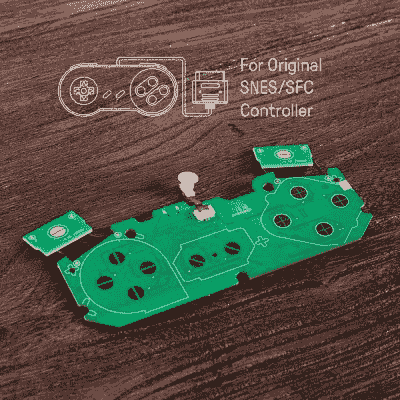

# 自带控制器套件，只需添加蓝牙

> 原文：<https://hackaday.com/2018/09/26/bring-your-own-controller-kits-just-add-bluetooth/>

[8bitdo]系列蓝牙控制器以其构建质量和低延迟而闻名，通常深受经典视频游戏爱好者的喜爱。它们将充电电池和蓝牙连接等现代便利与老派的配色方案和 D-pad 的可靠感觉相结合。他们目前提供的所有产品都是模仿过去控制台控制器的感觉，但是，对于一些人来说，没有什么可以替代原来的。对于这种类型的爱好者，该公司[创造了 DIY 蓝牙模块包](https://shop.8bitdo.com/products)的形式下降替代印刷电路板。

 特色 mod 套件适用于原厂 NES 控制器、SNES 控制器、6 键 Genesis 控制器。它们配备了一个 180 毫安的锂离子电池，估计可以玩 7.5 个小时，还有一个独特的桶塞式 USB 充电电缆。充电端口填补了控制器连接电缆留下的空白，也是 LED 状态指示器的两倍。虽然世嘉创世纪模块套件，充电端口改为标准微型 USB。

[8bitdo]网站号称可以兼容 Android、Linux、Mac 和 Windows(驱动程序允许的话)，甚至任天堂 Switch。通过添加该公司的一个复古接收器，您可以在最初的 NES 或 SNES 上使用控制器，同时使用当代的 NES/SNES 经典控制台。

因此，现在你可以无线玩所有这些老式游戏，而不需要像 90 年代的老式红外控制器那样直接瞄准。PCB 的整个安装过程被进一步简化，因为[8bitdo] mod 套件甚至提供了螺丝刀…想得真周到。

为经典控制器添加蓝牙的更多定制方法，请查看[这款 NES 控制器型号](https://hackaday.com/2015/01/23/turning-a-classic-nes-controller-into-a-bluetooth-controller/)。或者查看 8bitdo 的 NES 原始 mod 套件教程视频:

 [https://www.youtube.com/embed/Go_wn8uSs2I?version=3&rel=1&showsearch=0&showinfo=1&iv_load_policy=1&fs=1&hl=en-US&autohide=2&wmode=transparent](https://www.youtube.com/embed/Go_wn8uSs2I?version=3&rel=1&showsearch=0&showinfo=1&iv_load_policy=1&fs=1&hl=en-US&autohide=2&wmode=transparent)

