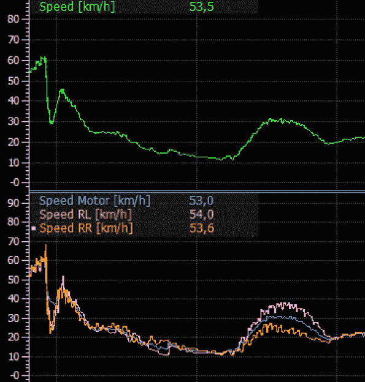

# 为遥控赛车带来专业级数据记录

> 原文：<https://hackaday.com/2019/08/04/bringing-pro-level-data-recording-to-rc-racing/>

我们都熟悉商用飞机上使用的“黑匣子”，这是一种飞行数据记录器，它捕捉每一次飞行的细节，万一发生事故时需要它。但即使在不太糟糕的情况下，飞机性能与飞行员命令的对比的完整记录也可以用来微调性能或在故障变得严重之前检测故障。

 作为一名职业赛车运动的数据工程师，[Jussi luopajrvi]知道类似的记录仪对于被困在陆地上的车辆同样有用。[他参加 2019 年 Hackaday 奖，TestLogger](https://hackaday.io/project/161577-testlogger-collector) ，旨在将同类技术引入遥控赛车世界。这个小工具可以让车手在比赛中轻松记录车辆的大量数据，让他们对车辆的性能有宝贵的见解。

那么在 1/8 或 1/12 比例的车上要记录什么样的变量呢？不要被他们小巧的轴距所迷惑，现代遥控汽车依赖于大量令人印象深刻的技术奇迹，这得益于近距离的观察。

目前，[Jussi]表示，TestLogger 不仅可以记录电池电量和油门等显而易见的元素，还可以记录更深奥的变量，如转向输入、单个驱动轮速度、角速度，甚至三维 g 力。还支持赛道旁的红外信标，允许测试记录器记录圈速。

所有的数据都存储在 TestLogger 的 SD 卡上的标准 CSV 文件中，这使得我们黑客类型很容易解析和分析。但对于那些对驾驶比对划界更感兴趣的人来说，还有一个非常漂亮的网站，可以让用户上传和比较他们的数据。这种完整的用户体验给了 TestLogger 一种非常专业的感觉，我们迫不及待地想看看[Jussi]会把它带到哪里。

随着功能强大的微控制器可用于一首歌曲，我们预计[这种详细的数据收集只会变得更加普遍](https://hackaday.com/2016/06/09/data-logging-everyones-doing-it-why-arent-you/)。

The [HackadayPrize2019](https://prize.supplyframe.com) is Sponsored by:     