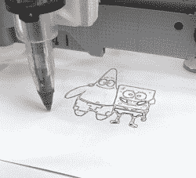

# 使用废弃的 DVD 驱动器构建绘图仪

> 原文：<https://hackaday.com/2019/04/29/build-a-plotter-using-scrap-dvd-drives/>

建造自己的数控机床会面临一系列不同的挑战。有软件方面的考虑，但也有机械方面的考虑——在工作设计中，电机、轴、螺钉和滑轨都需要考虑。当然，你总是可以外包一些工作——[这正是[丹尼尔·塔尔塔利亚]在这个笔式绘图仪上所做的(Youtube 链接，嵌入在下面)](https://www.youtube.com/watch?v=Q5ma1HDuotk)。

It’s a capable plotter, able to nicely reproduce both graphics and text.

凭借两个回收的 DVD 驱动器，该建筑获得了 X 轴和 Y 轴。托盘机制来准备去与步进电机和丝杠已经组装，并为一个紧凑的绘图仪奠定了良好的基础。木制框架是用来把所有东西固定在一起的。钢笔用橡皮筋固定在纸上，这有助于圆珠笔画出漂亮的深色线条，伺服系统用作钢笔缩回机构。一台带有步进驱动器防护罩的 Arduino Uno 随后被用来运行该节目。

这是一个整洁的建筑，整洁的电缆管理和聪明的设计选择给了它一个令人愉快的美感。CNC 的基础也很好——通过最小的反冲和斜率，绘图仪能够非常有效地绘图。[老式光驱是构建](https://hackaday.com/2010/03/31/cnc-plotter-from-old-parts-2/)、[绘图仪的流行选择，事实证明](https://hackaday.com/2014/03/14/old-inkjet-turned-into-an-svg-plotter/)。休息后的视频。

 [https://www.youtube.com/embed/Q5ma1HDuotk?version=3&rel=1&showsearch=0&showinfo=1&iv_load_policy=1&fs=1&hl=en-US&autohide=2&wmode=transparent](https://www.youtube.com/embed/Q5ma1HDuotk?version=3&rel=1&showsearch=0&showinfo=1&iv_load_policy=1&fs=1&hl=en-US&autohide=2&wmode=transparent)

