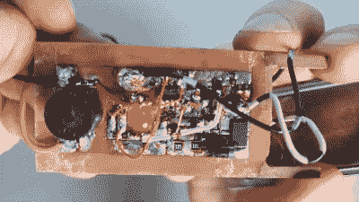

# 构建一个持久的连续性测试器

> 原文：<https://hackaday.com/2020/07/13/build-an-everlasting-continuity-tester/>

当你需要一台连续性测试仪时，你会怎么做？大概是你的万用表吧？你可能会惊讶地发现，电表中的连续性测试仪并不那么灵敏，即使它是黄色的昂贵的那种。即使线路中有 50ω的电阻，【Leo】的也会发出嘟嘟声。

厌恶现代的商业测试人员，[Leo]开始以做一件事并且做得很好的老学校工具的精神来制造理想的连续性测试人员。[它必须易于使用，随时可用，能够在 5ω或更小的电阻下测量连续性](https://www.youtube.com/watch?v=N2M-p-OGvPg)(视频，嵌入下方)。

 这里没有电源开关，甚至没有标签，因为它不需要任何东西。只要把探头放在你想放的地方，它要么发出哔哔声，点亮 LED，要么不亮。它看起来很简单，但在防爆外壳内有许多很酷的功能，这无疑使它成为我们理想的测试器。

我们最喜欢的是瞬变阻断单元，它的工作原理就像一个小断路器。它们通过耗尽型 MOSFETs 来保护电路免受光照和静电放电的影响，并在不到一微秒的时间内切换到保护模式。观看[狮子座]建立这个工作台的必要性，然后滥用测试后，与主电源休息。

制作自己的工具，无论多么简单或复杂，都是一种很棒的体验。如果你想加快你的原型制作游戏， [[Leo]为你提供了一种特殊的手工刻划铜印刷电路板的工具](https://hackaday.com/2020/05/24/ironclad-tips-for-copper-clad-prototyping/)。

 [https://www.youtube.com/embed/N2M-p-OGvPg?version=3&rel=1&showsearch=0&showinfo=1&iv_load_policy=1&fs=1&hl=en-US&autohide=2&wmode=transparent](https://www.youtube.com/embed/N2M-p-OGvPg?version=3&rel=1&showsearch=0&showinfo=1&iv_load_policy=1&fs=1&hl=en-US&autohide=2&wmode=transparent)

