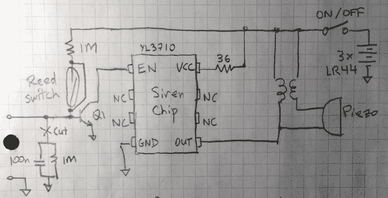

# 花 1.02 美元就能造出这种方便的测漏器

> 原文：<https://hackaday.com/2019/10/23/build-this-handy-leak-detector-for-1-02/>

您可能已经注意到，现代生活已经变得相当复杂，我们在 Hackaday 上讨论的项目也不能幸免于进步的步伐。我们当然不会抱怨，但我们会承认偶尔会做一个渴望的白日梦，回到 Hackaday 的首页看起来更像 MacGyver 而不是 T2 微软的日子。

这也是为什么这个由[dB]黑出来的水警报器如此吸引人的原因。这个被称为“SqueakyLeaks”的小玩意最初是一个简单的无线入侵报警器，来自美元树。当磁铁离电池供电的底座足够远时，90 分贝的颤音就会响起，让你知道有人打开了不该打开的窗户或门。

但是，通过一点点重新布线和两枚加拿大便士作为触点，这个警报器已经被转换成一个水探测器，可以放置在热水器等潜在的漏水设备周围，或者放置在你想得到积水警报的地方，如集水坑。它们基本上是“一劳永逸”的，因为[dB]说，报警器中使用的三节 LR44 电池应该可以使用大约两年。虽然 BOM 只有 1.02 加元，但生产多个并在电池耗尽时扔掉可能更便宜。

这个项目是典型的硬件黑客，看不到 Arduino 或 Raspberry Pi。即使你不像[dB]那样担心漏水而夜不能寐，你也不得不欣赏这种解决方案的独创性和节俭。

当然，在光谱的另一端，你总是可以为自己建立一个复杂的系统，它会根据高水位或水泵故障向你发送电子邮件。什么都行。