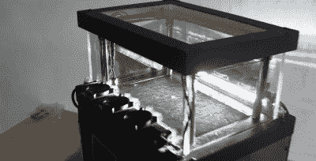

# 建造一个更大的云室

> 原文：<https://hackaday.com/2019/07/20/building-a-bigger-cloud-chamber/>

云室是一个令人兴奋和高度可视化的科学实验。当你亲眼看到来自放射性衰变的亚原子粒子通过时，它们看起来很迷人。许多人选择建造基于热电帕尔贴元件的小室，但是 Cloudylabs 决定做一些更大规模的东西。

It’s a hefty chamber, and a very clean build.

2010 年，在一个博物馆里第一次看到云室后，Cloudylabs 开始建造云室。第一个原型是一个空气冷却的帕尔贴设备，冷却面积只有 4x4cm 厘米。多年来，在建造了更多的基于帕尔贴的腔室后，热电模块变得不太坚固，经常在多次热循环后失效。为了更上一层楼，[Cloudylabs]选择建造一个基于相变技术的更大的单元，类似于冰箱的工作方式。

最终产品令人震惊，由一个 32x18cm 厘米的主动冷却区域组成，安装在一个大玻璃观察箱内。一个磁铁安装在下面，这使得某些粒子相对于磁场弯曲，顶部还有一个带电的网格。该室能够在不需要任何用户干预的情况下运行长达 12 小时。

云室总是美丽的，在这个更大的尺度下更是如此。当放射性物质被引入室内时，产生的尾迹很长，很容易看到。然而，这是一个令人生畏的构建，最终产品重量超过 30 公斤。对于你的第一个版本，你可能想从小一点的开始。休息后的视频。

 [https://www.youtube.com/embed/weyk5RWgZ1w?version=3&rel=1&showsearch=0&showinfo=1&iv_load_policy=1&fs=1&hl=en-US&autohide=2&wmode=transparent](https://www.youtube.com/embed/weyk5RWgZ1w?version=3&rel=1&showsearch=0&showinfo=1&iv_load_policy=1&fs=1&hl=en-US&autohide=2&wmode=transparent)

