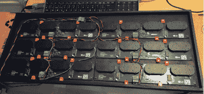

# 建造一个由小时钟组成的巨型元时钟

> 原文：<https://hackaday.com/2020/01/01/building-a-giant-meta-clock-made-of-smaller-clocks/>

你有没有在十年结束前完成的最后一分钟的项目？为了打发时间，[Erich Styger]决定建造一个由 24 个独立模拟时钟组成的[元数字时钟](https://mcuoneclipse.com/2019/12/29/diy-meta-clock-with-24-analog-clocks/)，这是迎接新年的完美物品。步进时钟由 LPC 微控制器网络控制，显示时间和室温，以及几个美观的加载动画。

对于完整的 24 时钟设置，每个时钟采用 5 V USB 电源供电，功耗低于 2 A。元时钟位于激光切割外壳中，带有 3D 打印的指针来显示时间。虽然每个时钟一个电路板更容易实现，但[Erich]决定每四个成行排列的时钟使用一个电路板，以节省成本。这种安排固定了时钟之间的距离，尽管[Erich]也将时钟尺寸做得稍微小一些以进行补偿。

步进时钟的“步进器”部分使用 360 度版本的 VID28 步进电机，以降低设计高度和项目成本。除了 X12.017 驱动器安静地驱动电机外，步进电机还方便地只需要一个“方向”和“步进”引脚，减少了微控制器所需的引脚数。钕磁铁和霍尔效应传感器用于在时钟移动时跟踪指针的位置，磁铁嵌入时钟指针中。

至于通信，没有使用常见的 I2C 协议，而是选择了更强大的 RS-485。主机使用总线协调所有时钟，提供命令行接口。主机还能够通过 USB 与主机通信，以维持 RTC 时间。

在软件开发阶段，[Erich]利用 SEGGER J-Link EDU mini CLI 跟踪有关驱动程序和每个步进电机的信息。控制电机的软件是用 C 语言编写的，主板运行自由操作系统。步进由定时器中断处理，但由于 LPC845 没有足够的定时器通道，所有功能都在一个通道内完成。这会在代码中产生大量的中断处理程序、标志和回调，这很有趣。

说到时钟，看看我们过去的一些时钟黑客，包括这个[迷你 VFD 时钟](https://hackaday.com/2019/09/26/mini-vfd-clock-floats-the-display-above-it-all/)和这个有趣的 [LED 矩阵时钟](https://hackaday.com/2019/06/27/led-matrix-becomes-fun-tetris-clock/)(它可以让你玩俄罗斯方块！)

 [https://www.youtube.com/embed/WsxtxT9oboM?version=3&rel=1&showsearch=0&showinfo=1&iv_load_policy=1&fs=1&hl=en-US&autohide=2&wmode=transparent](https://www.youtube.com/embed/WsxtxT9oboM?version=3&rel=1&showsearch=0&showinfo=1&iv_load_policy=1&fs=1&hl=en-US&autohide=2&wmode=transparent)

