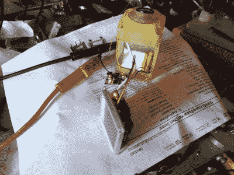

# 从头开始构建一个万向摩托车头盔相机

> 原文：<https://hackaday.com/2020/08/16/building-a-gimballed-motorcycle-helmet-camera-from-scratch/>

[谢妮盖伊]在一个摩托车头盔摄像头项目中触及了所有重要的设计元素[,这个项目如此之多，以至于构建日志跨越了三个帖子。这些相机需要经得起风吹雨打，还要经得起时速 80 英里的昆虫袭击。它们需要牢固地附着在头盔上，而不影响头部的视觉或运动。你应该能够调整他们的指向。消费类相机的功能和成本之间的平衡让这个列表很难令人满意——但有了这些技能，自举相机就很棒了！](https://electronicmercenary.wordpress.com/2020/07/13/no-limits-a-helmet-camera-story-i/)

 哪里可以买到小型、高质量的相机？无人机行业十年来一直在迭代解决这个问题，这就是这项发明的精髓所在。这产生了一个有趣的问题，CADDX 海龟 V2 相机的电路板在使用时会变得非常热，需要有空气流过。因此，他将一个定制的散热器扔进 SLA 树脂印刷外壳的侧面，以保持冷却。

既然工厂已经预热了，为什么不做些模具制作呢？已经在进行一个项目，使用[软 PCB 膜的铸造工艺](https://electronicmercenary.wordpress.com/2020/07/29/tatoo-parlor/)，这是保持头盔摄像头上的按钮和 SD 卡插槽不受天气影响的完美技术。里面有一个小电池提供电力，背面的充电口是一个漂亮的小磁铁。

一切都非常完美。[谢妮盖伊]确实感叹树脂外壳的颜色，但这可以很容易地用彩色树脂重印修复。

当你往头盔上扣东西的时候，[也许一些多余的首饰是合适的](https://hackaday.com/2012/09/14/helmet-of-many-leds-built-for-burning-man/)？

 [https://www.youtube.com/embed/ZhrlO9keNXg?version=3&rel=1&showsearch=0&showinfo=1&iv_load_policy=1&fs=1&hl=en-US&autohide=2&wmode=transparent](https://www.youtube.com/embed/ZhrlO9keNXg?version=3&rel=1&showsearch=0&showinfo=1&iv_load_policy=1&fs=1&hl=en-US&autohide=2&wmode=transparent)

