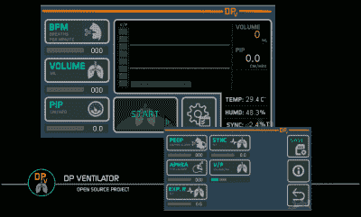

# 构建一个重型开源呼吸机

> 原文：<https://hackaday.com/2020/08/28/building-a-heavy-duty-open-source-ventilator/>

自从新冠肺炎·疫情开始以来，我们已经看到了几次试图创造自制呼吸机的尝试，旨在解决这些救生机器的短缺。不幸的是，在设计实用的医疗设备方面，大多数黑客都不太有经验。因此，虽然许多设计可能在工作台上看起来很实用，但它们在任何官方场合使用的可能性很小。

开源 DP 呼吸机显然仍然是几个勇敢的黑客的产品，但我们认为它显示了在许多早期尝试中所缺失的设计成熟度的[水平。这种机械设备主要由 3D 打印组件制成，旨在操作手持手动复苏器；本质上是代替人类操作员。这使得该设计远没有实际上必须自己泵送空气复杂，更不用说对患者更安全，因为安装在其中的复苏器(通常称为急救袋)将是无菌的预包装物品。](https://hackaday.io/project/171890-dp-ventilator)

在休息后的视频中，你可以看到在设备的触摸屏界面上投入了多少思想和精力。只需快速点击几下，操作 DP 呼吸机的医疗专业人员就可以根据患者的需求调整呼吸频率、压力和容量等变量。虽然作为机器核心的 Arduino Mega 2560 不符合任何负责医疗设备的监管机构的要求，但我们认为，再做一些调整，这种设计就越来越接近实际上可能能够拯救生命的东西。

 [https://www.youtube.com/embed/GMOeC1Nxmx0?version=3&rel=1&showsearch=0&showinfo=1&iv_load_policy=1&fs=1&hl=en-US&autohide=2&wmode=transparent](https://www.youtube.com/embed/GMOeC1Nxmx0?version=3&rel=1&showsearch=0&showinfo=1&iv_load_policy=1&fs=1&hl=en-US&autohide=2&wmode=transparent)

The [HackadayPrize2020](https://prize.supplyframe.com) is Sponsored by: