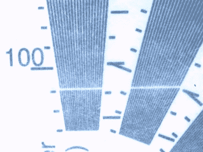

# 建造一个高速、高分辨率的激光头

> 原文：<https://hackaday.com/2019/10/22/building-a-laser-head-with-high-speed-high-resolution/>

A test exposure on cyanotype paper shows off the prototype’s resolution, around 100 microns.

通常，当扫描激光时，它是通过检流计或旋转镜组件来完成的。然而，这些方法可能是缓慢和麻烦的，或者由于现有的专利而受到限制。[Rick]旨在通过 Hexastorm 项目找到一种替代解决方案，[使用旋转棱镜来构建高速、高分辨率的激光头。](https://hackaday.io/project/21933-open-hardware-fast-high-resolution-laser)

该项目目前使用比格犬骨作为大脑，多边形电机来自复印机，用于以超过 20，000 rpm 的速度旋转棱镜。该项目旨在证明旋转棱镜技术的概念，然后可以适用于特定的任务。凭借高速和高分辨率的承诺，该系统可用于 PCB 制造、3D 树脂打印甚至虚拟现实显示等各种领域。[【Rick】通过与市场上现有解决方案的比较，在一场推介活动中探索这些潜在市场](https://cdn.hackaday.io/files/21933938381472/analysts_presentation.pdf)。

如果你对高性能光学系统感兴趣，[Rick]的工作是引人入胜的读物。这也不是我们第一次探索尖端激光黑客技术。休息后的视频。

 [https://www.youtube.com/embed/mzfa3sfhWdw?version=3&rel=1&showsearch=0&showinfo=1&iv_load_policy=1&fs=1&hl=en-US&autohide=2&wmode=transparent](https://www.youtube.com/embed/mzfa3sfhWdw?version=3&rel=1&showsearch=0&showinfo=1&iv_load_policy=1&fs=1&hl=en-US&autohide=2&wmode=transparent)

[hack adayprize 2019](https://prize.supplyframe.com)主办单位:     