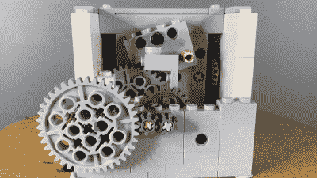

# 用乐高建造一个摆钟

> 原文：<https://hackaday.com/2022/03/09/building-a-pendulum-clock-out-of-lego/>

如今，摆钟已经不那么常用了，因为它们笨重的机械和计时能力早已被电子替代品超越。然而，它们仍然很有趣，而且确实有效，所以[PuzzLEGO] [开始用乐高](https://www.youtube.com/watch?v=bxeKTr1XJG0)搭建一个工作示例。

The rear view reveals the escapement built from Lego Technic parts.

钟表的核心是擒纵机构，一个钟摆只能朝一个方向转动的联动装置。当钟摆每秒摆动一次时，它让擒纵齿轮一次向前转动一个档位，转动驱动指针的钟表齿轮。它由一个装满水的饮料瓶形式的下落重物提供动力，通过链条转动时钟的齿轮。

时钟只能运行大约一个小时，所以它设置了秒针和分针，而不是更常见的分针和时针。然而，随着钟摆调整到合适的长度和重量，它愉快地滴答滴答走秒。

我们以前也见过其他来自[PuzzLEGO]的很棒的构建，[像这个发明的魔方构建](https://hackaday.com/2021/10/23/you-can-build-a-lego-rubiks-cube/)。休息后的视频。

 [https://www.youtube.com/embed/bxeKTr1XJG0?version=3&rel=1&showsearch=0&showinfo=1&iv_load_policy=1&fs=1&hl=en-US&autohide=2&wmode=transparent](https://www.youtube.com/embed/bxeKTr1XJG0?version=3&rel=1&showsearch=0&showinfo=1&iv_load_policy=1&fs=1&hl=en-US&autohide=2&wmode=transparent)

