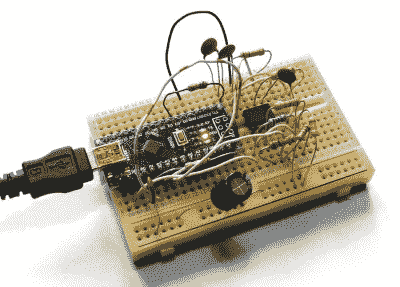

# 构建袖珍 Arduino 示波器

> 原文：<https://hackaday.com/2018/09/21/building-a-pocket-sized-arduino-oscilloscope/>

毫无疑问，示波器是电子黑客的必备设备。这是逆向工程设备和协议的关键部分，对我们来说幸运的是，它们比以往任何时候都便宜。即使是功能相当丰富的四通道示波器，如 Rigol DS1054Z，价格也只相当于一部中档智能手机。但是，如果对你的口味来说这仍然有点太丰富了，并且你愿意稍微节省一些功能，你可以花比口袋零钱多一点的钱得到一个功能性的数字示波器。

 虽然市场上有很多非常便宜的袖珍数字存储示波器(DSO)，但[【彼得·鲍尔奇】决定用现成的元件组装自己的版本](https://www.instructables.com/id/Oscilloscope-in-a-Matchbox-Arduino/)。这不仅是深入研究一些有趣的工程挑战的借口，而且最终带来了比交钥匙模型更低的价格。由一个 Arduino Nano 和一个有机发光二极管显示器组成，一个火柴盒大小的像样的 DSO 的成本不到 10 美元。

但不是很棒的那种。[Peter]非常坦率地谈到了这种 DIY 袖珍示波器的局限性:它不能达到非常高的采样率，显示器也不够大，除了基本功能之外，无法传达任何东西。但是，如果您在现场进行一些快速而肮脏的诊断，这可能就是您所需要的。尤其是因为你很有可能可以用垃圾箱里的零件来组装这个东西。

即使您不打算构建自己版本的 Arduino 驱动的 scope [Peter]描述，他的文章仍然充满了迷人的细节和理论。他解释了他的软件方法是如何禁用所有中断，并将微控制器置于一个紧密的轮询环路中，以尽快从 ADC 读取数据。为 Atmega 的 16MHz 时钟找到合适的预分频器值需要一些实验，但最终他发现可以以 1uS 的采样率获得可用的(如果有点噪声)输出。

不幸的是，Arduino 的 ADC 在输入范围方面还有待改进。但由于增加了 LM358 双通道运算放大器，Arduino 示波器获得了一些放大，因此可以拾取 mV 范围内的信号。为了完整起见，[Peter]在设备的固件中加入了一些有用的功能，比如频率计数器、方波信号源，甚至还有电压表。随着 3D 打印外壳的加入，这个小工具可以非常方便地放在您的移动工具包中。

如果你更愿意走商业路线，Hackaday 自己的[Jenny List]已经审查了许多非常实惠的型号[，如 DSO Nano 3](https://hackaday.com/2018/08/06/review-a-20-mhz-pocket-scope-for-not-a-lot/) 和 [JYE Tech DSO150 自己动手组装套件](https://hackaday.com/2017/11/09/review-jye-tech-dso150-oscilloscope-kit/)。

【感谢 BaldPower 的提示。]