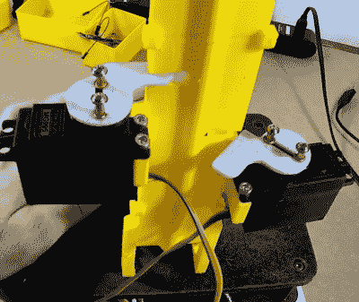

# 建造半自动 Swag 发射器

> 原文：<https://hackaday.com/2019/02/15/building-a-semiautomatic-swag-launcher/>

在这一点上，Hackaday 的老读者肯定已经看过了(杰里米·库克)的作品。无论你是记得他作为这个优秀在线出版物的作者，还是从他过去几年令人印象深刻的作品中认出他的名字，他都是这个地区真正的名人。事实上，他在活动中被粉丝团团围住，为了自己的安全起见，他不得不雇用一个机器人同伴来分发他的个性化按钮。

 好吧，那可能是*某事*的一种延伸。但(杰里米)认为，在最近的棕榈湾迷你创客博览会上，有一个有趣的硬件分发他的礼物不会有什么坏处。任何人都可以在桌子上的碗里放一些贴纸和纽扣，但这不是黑客的方式。在休息后的视频中，他带领观众通过这个有趣的小工具的设计和构造，它有几个意想不到的转折，并包含了许多有用的提示，值得单独入场费。

从表面上看，3D 打印设计非常简单，让我们想起了火柴盒汽车的轨道套件。正如你所料，让按钮滑下印刷轨道非常容易。尤其是当杰里米把内线锉平，让他们真正动起来的时候。但我们的目标是在每次触发设备时分配一个按钮，但这最终说起来容易做起来难。

第一次尝试使用由两个伺服系统驱动的磁铁，一个用来放下按钮，另一个用来举起排在它上面的按钮。这工作很好…在第一。但是[杰里米]最终发现，当他在轨道上堆积更多的纽扣时，磁铁不够强大，无法将它们吸住，它们开始“泄漏”。这是一个很好的例子，说明一个系统在初始测试时可以完美地工作，但是一旦进入现实世界就会崩溃。

在这种情况下，解决方案相对简单。[Jeremy]保留了由 Arduino 和电容传感器控制的两个伺服系统，但用物理杠杆取代了磁铁。原理是一样的，但现在系统足够强大，可以承受滑槽中按钮的总重量。这确实需要他在已经组装好的赛道上切入，但我们不能责怪他不想重新开始。

就像受街机启发的糖果分发机一样，想出一种独特的方式向路人分发物品是将平凡变成难忘事件的绝佳方式。也许在下一次迭代中，他可以让[得到一个按钮需要你通过一个黑客琐事测试。](https://hackaday.com/2016/03/08/candy-dispenser-riddles-you-this/)真正让他们为之努力。

 [https://www.youtube.com/embed/3mXGkIkcyXI?version=3&rel=1&showsearch=0&showinfo=1&iv_load_policy=1&fs=1&hl=en-US&autohide=2&wmode=transparent](https://www.youtube.com/embed/3mXGkIkcyXI?version=3&rel=1&showsearch=0&showinfo=1&iv_load_policy=1&fs=1&hl=en-US&autohide=2&wmode=transparent)

