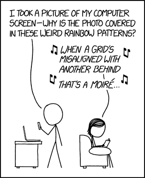

# 构建旋转莫尔效果灯

> 原文：<https://hackaday.com/2019/12/28/building-a-spinning-moire-effect-lamp/>

A concise, comical explanation of Moiré patterns, via [XKCD](http://xkcd.com/1814).

莫尔条纹是当不同尺寸或排列的网格相互重叠时产生的干涉图案。你可能在拍摄电视屏幕或同时透过一对窗户屏幕观看时见过这些。[ChrysN]将[效果应用到这个旋转云纹灯构建](https://www.instructables.com/id/Moire-Effect-Spinning-Lamp/)中。

这是一个可以用废物箱组件实现的构建。一个 LED 外壳的 PC 冷却风扇被用作灯的底座，安装了 Sugru 保险杠来支撑一个便宜的玻璃花瓶。然后将线条图案印在纸上，卷成圆筒，滑到花瓶内的风扇上，随着叶片旋转。然后将另一个线条图案印在透明胶片上(对于那些不记得高射投影仪的人来说，这是一种可打印的透明片),并沿着花瓶的外部滑动。通电后，led 发光，风扇旋转，创造出令人着迷的移动云纹图案。

这是一个简单但视觉上迷人的建筑，[并且由于蓝色的 led 灯](https://hackaday.com/2016/10/07/blue-led-streetlights-keeping-you-awake/)，它应该让你在晚上保持清醒。云纹图案可以做得更多—[它们甚至被用于指导船只。](https://hackaday.com/2018/04/07/using-moire-patterns-to-guide-ships/)休息后的视频。

 [https://www.youtube.com/embed/pdxXNmfi17g?version=3&rel=1&showsearch=0&showinfo=1&iv_load_policy=1&fs=1&hl=en-US&autohide=2&wmode=transparent](https://www.youtube.com/embed/pdxXNmfi17g?version=3&rel=1&showsearch=0&showinfo=1&iv_load_policy=1&fs=1&hl=en-US&autohide=2&wmode=transparent)

