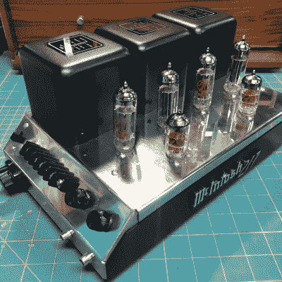

# 打造经典风格的电子管立体声放大器

> 原文：<https://hackaday.com/2022/07/31/building-a-tube-based-stereo-amp-in-classic-style/>

我们并不是每天都能看到有人在老式电子管放大器上进行自我旋转的结果，但这正是[lens42]在创造[麦金托什 217 时所做的，麦金托什 217 是麦金托什 MC 275](https://lensprojects.com/2022/03/03/a-tube-stereo-amp-built-in-the-style-of-classic-mcintosh/)的“迷你”版本，这是一种经典的音频设备。上面两张照片是相邻的。

 说到老式高保真立体声放大器，有两个单元对[lens42]有着特殊的意义:麦金托什 MC275 功率放大器和 Dynaco ST35。Dynaco 是一款更经济的放大器，但看起来像一个普通的盒子。然而，麦金托什骄傲地展示了电子管和变压器的辉煌。“麦金托什 217”在设计上基本上是一个较小的麦金托什 MC275，具有 Dynaco ST35 的内部结构。

有这么多需要从头开始设计，CAD 是无价的。元件布局、外壳设计，甚至布线和标签都必须在加热烙铁之前尽可能地确定下来。即便如此，还是有一些打嗝；供应商对管座的测量不正确，这意味着零件不合适。一个变通办法是修改漏洞，幸运的是，这种改变并不碍眼。尽管如此，[lens42]提醒我们所有人，在发送 CAD 文件进行切割或制作之前，尽可能准备好所需的零件以确认尺寸。

我们中的许多人都可以联系到这样一个事实，即整个项目是一个爱的劳动，没有真正的财务意义，但最终的结果是非常棒的，创造这样一个东西是我们所有人都可以欣赏的——不仅仅是那些难以捉摸的“管道声”的追逐者。