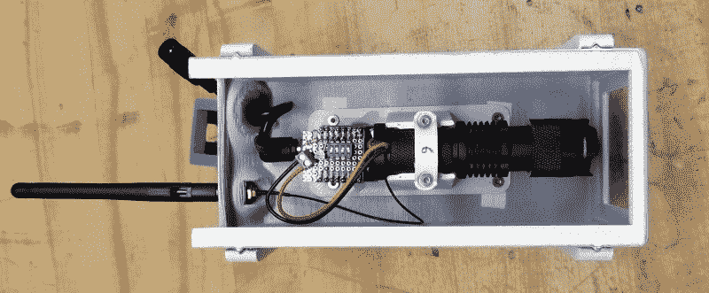

# 以艺术的名义建立一支人造相机大军

> 原文：<https://hackaday.com/2021/08/10/building-an-army-of-faux-cameras-in-the-name-of-art/>

在当地家得宝排队时，记住了对准他的监控摄像头的数量后，[【Mac Pierce】受到启发，发明了](https://www.macpierce.com/a-scanner-darkly) *[深色扫描仪](https://www.macpierce.com/a-scanner-darkly)。*这个艺术装置使用模拟安全摄像头投射的光束在对面的墙上创建一个点阵字符显示，慢慢闪烁出美国的监控法律和法规。

[Mac]已经收集了[关于他如何创造了*一台黑暗扫描仪*](https://www.macpierce.com/blog/2021/8/1/the-making-of-a-scanner-darkly) 的大量幕后资料，其中包括生产用于投影 3×5 网格的 15 台相同相机所花费的令人难以置信的时间和精力。早些时候，他决定用 3D 打印每一张照片，因为这将让他完全控制最终结果。但考虑到它们相当大的尺寸，最终打印出所有部件需要 230 个小时和 12 公斤 PLA 细丝。又花了 55 个小时打磨和油漆相机外壳，以确保它们看起来不像是 3D 打印的*。*

在内部，每台相机都有一个现成的 LED 手电筒，它的电源按钮安装在 ESP8266 上。一旦它们被手动指向墙上的适当位置，[Mac]就可以通过 WiFi 打开和关闭每个摄像头的聚光灯。所有摄像机都通过 ESP-Now 连接到作为中央控制器的 ESP32 M5Stack，而不是依赖于画廊的基础设施。

从那时起，只需编写一些代码，从 SD 卡加载文本文档，将当前字符转换为 3×5 数组，然后命令相应的摄像机打开或关闭灯光。[Mac]不仅为 3D 打印相机提供了 STL 文件，还提供了客户端和服务器 Arduino 代码来控制灯光。结合他出色的文档，这使得*成为一个黑暗的扫描仪*有点像病毒艺术作品；因为只要有时间和合适的工具，任何人都可以复制该安装，或者将其作为新安装的基础。

虽然有些人无疑会说，如果[Mac]只是修改了一些商业虚拟相机，他可以更快地完成这个项目[，但重要的是要记住，作为一名艺术家，他对*黑暗扫描仪*有非常具体的想法。这个项目是一个完美的例子，展示了创作者的激情如何将一个想法带到新的高度，我们认为最终结果证明了付出额外的努力是值得的。](https://hackaday.com/2019/05/22/dummy-security-camera-is-smarter-than-it-looks/)

[https://player.vimeo.com/video/582136654](https://player.vimeo.com/video/582136654)