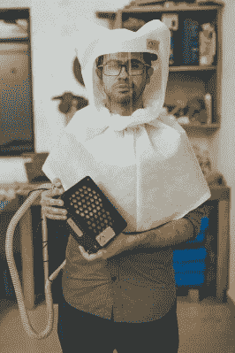

# 建造氧气浓缩器:这不是火箭科学

> 原文：<https://hackaday.com/2021/05/10/building-an-oxygen-concentrator-it-isnt-rocket-science/>

早在疫情开始的时候，各种各样的黑客救生机械设计可能已经突破了患者安全的界限。有充分的理由认为，呼吸机必须通过广泛的安全测试和认证，才能连接到病人身上，因为如果它以某种方式失败，病人就会死亡。一年后，作为努力的一部分，我们有许多更安全和更现实的方法来使用我们的技能。

可能最雄心勃勃的项目之一来自印度黑客空间联盟，他们正在为当地生产改造一个成熟的氧气浓缩器。其中包括 Hackaday 自己的[Anool Mahidharia]，他主持了一个制造商的庇护视频(嵌入在下面)，解释氧气浓缩器如何工作以及如何安全地制造它们。

The team have proven their ability in manufacturing over the past year, here showing off the M19 motorised air purifying respirator.

氧气浓缩器出奇的简单，而且充满了魔力。在其中心是两个沸石柱，这是一种高度多孔的硅铝酸盐矿物，具有分子筛的功能。当空气被泵入柱中时，沸石捕获氮气，留下富氧残余物继续供应。有两个这样的柱，以允许每个柱处于富集或净化的交替循环中，以去除累积的氮气。

该视频的目的是展示这种装置可以用现成的零件和普通的工具来建造；正如标题所说，这不是火箭科学。黑客空间联盟生产的浓缩器本身不会拯救世界，但作为联合努力的一部分，它们可以提供有用和可靠的氧气来源，这将在一个氧气分配网络面临严重压力的国家产生重大影响。

我们之前报道过印度氧气浓缩厂启动项目时的努力。[他们的网站可以在创客庇护网站](https://www.makersasylum.com/m19-initiative/)上找到，而[他们的众筹活动可以在印度众筹平台 Ketto](https://www.ketto.org/fundraiser/m19-oxygen-concentrators-make-in-india) 上找到。他们已经证明了他们协调大规模生产与他们之前的个人防护装备和呼吸器项目的能力，所以如果可以的话，请考虑支持他们。与此同时，从视频中对创客避难所的短暂一瞥，我们不禁一阵空间嫉妒。

 [https://www.youtube.com/embed/tobUvesSOzw?version=3&rel=1&showsearch=0&showinfo=1&iv_load_policy=1&fs=1&hl=en-US&autohide=2&wmode=transparent](https://www.youtube.com/embed/tobUvesSOzw?version=3&rel=1&showsearch=0&showinfo=1&iv_load_policy=1&fs=1&hl=en-US&autohide=2&wmode=transparent)

