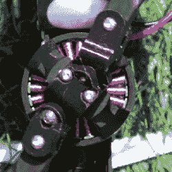

# 用虚拟旋转斜盘建造和驾驶直升机

> 原文：<https://hackaday.com/2020/06/25/building-and-flying-a-helicopter-with-a-virtual-swashplate/>

他们说鼓手是最好的直升机飞行员，因为要掌握旋翼飞机的控制，你真的需要能够用每个肢体做不同的事情，并且仍然让所有的动作相互协调。控制的复杂性是由于旋转斜盘的机械复杂性，它将控制输入转化为旋翼桨叶迎角的集体和循环变化。

正如[汤姆·斯坦顿]在他的最新视频中指出的那样，[旋转斜盘并不总是需要的](https://www.youtube.com/watch?v=d80oXSCcHTk)。多直升机通过差动控制四个或更多的马达来提供滚转、俯仰和偏航控制，从而免除了对一个马达的需求。但由于他发现的一篇博士论文，通过用柔性旋翼铰链和精确的电机速度控制代替旋转斜盘，也可以控制传统的单旋翼直升机。

 你只需要看慢动作视频就能明白发生了什么:随着电机速度在一次旋转中变化，铰接转子叶片的尖端在周期的受控部分领先和滞后主轴。铰链是倾斜的，这意味着每个旋翼桨叶的迎角在每次旋转过程中都会发生变化——这正是旋转斜盘通常实现的效果。正如你所想象的，当一个马达以 3000 转/分的速度旋转时，在一次旋转中调整它的速度不是一件容易的事，[汤姆]在他的第二个频道的[后续视频](https://www.youtube.com/watch?v=Y31BhQToh_U)中详细介绍了这一点。

它可能不会很快取代四轴飞行器，但我们真的很喜欢旋翼飞行的课程。[汤姆]总是能很好地解释事情，不管是[二氧化碳效应](https://hackaday.com/2019/08/20/putting-the-coanda-effect-to-work-on-a-quadcopter/)还是[自行车防抱死刹车](https://hackaday.com/2019/02/17/anti-lock-brakes-for-bike-might-make-rides-a-little-safer/)。

 [https://www.youtube.com/embed/d80oXSCcHTk?version=3&rel=1&showsearch=0&showinfo=1&iv_load_policy=1&fs=1&hl=en-US&autohide=2&wmode=transparent](https://www.youtube.com/embed/d80oXSCcHTk?version=3&rel=1&showsearch=0&showinfo=1&iv_load_policy=1&fs=1&hl=en-US&autohide=2&wmode=transparent)

