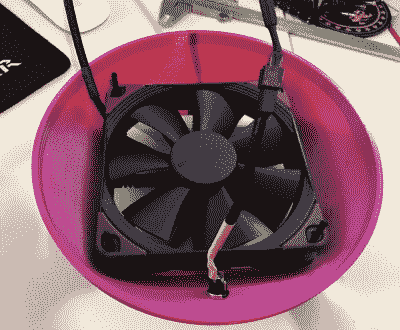

# 构建(和测试)一个 DIY 空气净化器

> 原文：<https://hackaday.com/2020/01/29/building-and-testing-a-diy-air-purifier/>

无论是城市中常见的污染，还是地球上你所在的那个角落正在着火，糟糕的空气质量是许多人日常生活的一部分。解决这个问题的一个方法是在家里安装高质量的 HEPA 过滤器，但不幸的是，这并不是每个人都能负担得起的。

这就是为什么[Adam Kelly]决定[设计这款 DIY HEPA 空气净化器，它的造价不到 100 美元](https://github.com/Kels316/DIY-Air-Purifier)。这听起来可能仍然是一大笔钱，但与卫生官员推荐的型号 500 美元的标价相比，这无疑是朝着正确方向迈出的一步。当然，如果它真的有效，这只是一笔交易，所以该项目的很大一部分也一直在验证设计及时过滤空气中颗粒的能力。

 为了制造他的净化器，【亚当】找到了一个便宜又容易买到的 HEPA H13 级替换过滤器，并开始设计一种低成本的方法来过滤空气。他最终选择了一个 120 毫米的电脑机箱风扇，并配有一个升压转换器，可以从标准 USB 端口产生 12 V 电压。然后，他只需要设计一个 3D 打印的“盖子”，它将定位风扇，使其通过过滤器的中心吸入空气。

在测试方面，[亚当]并不担心净化器实际过滤烟雾颗粒的能力；除非制造商对过滤器本身的性能撒谎，否则这部分是已知的。但是他很好奇风扇在室内空气循环方面的效率。

通过将他的一架无人机上的皮托管安装到净化器的盖子上，他确定过滤器中心的气流大约为 160 CFM。根据他的计算，这意味着它应该能够让他 25 立方米办公室的所有空气每小时循环 10 次左右。这是一个有希望的开始，但[亚当]说，他仍然有兴趣让任何有设备的人对该设计的性能进行更详细的分析。

由于他住在澳大利亚，这个项目对[亚当]来说不仅仅是一个短暂的幻想。他只需向窗外望去，就能看到他呼吸的空气中充满了熊熊的森林大火产生的烟雾。他们说需要是发明之母，可呼吸的空气在人类必需品的清单上排在很高的位置。我们向那些看到自己的同胞遭受苦难并且[试图利用他们的技能提出解决方案的人脱帽致敬。](https://hackaday.com/2019/04/05/building-an-army-of-esp32-air-quality-sensors/)