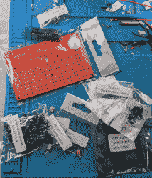
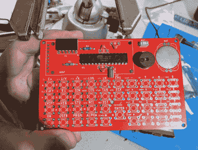
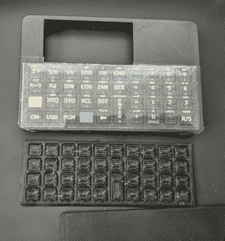
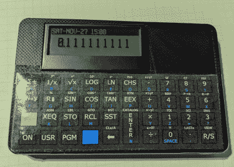

# 构建 DIY HP41C:现场报告

> 原文：<https://hackaday.com/2021/12/03/building-the-diy-hp41c-a-field-report/>

我要坦白一件事。我为 Hackaday 写了很多项目，但是很少有我读到的，然后实际去创建它的副本。我没有太多的时间，而且我通常都忙于建造自己的东西。但是偶尔，有些东西会吸引我的注意力，我要么去翻垃圾箱，要么去买工具箱。最近的例子是 PX-41C，它是经典 HP-41C 的复制品。

Nicely bagged parts.

HP-41C 是有点传奇色彩的逆波兰符号计算器。我仍然保留着 1979 年的 HP-41C(序列号很低)。它仍然是一匹老黄牛，但在 43 岁左右，我不喜欢让它挂在周围或靠近任何可能损坏它的东西。从 40 年前收到的日常使用，它已经有足够的磨损。当然，我的手机上有很棒的仿真软件，我也在用，但 PX-41C 套件看起来很有趣，而且所有的通孔部件都可以快速构建。Tindie 上的黑色星期五销售[为我敲定了这笔交易。](https://www.tindie.com/products/hobbystone/px41c-an-hp41c-hardware-emulator/)

## 启动

工具包在感恩节后的周六到达，我决定在等待一些 3D 打印时处理它。所有的部件都包装好并做了标记。撕开袋子有点令人沮丧，但并不难，它确实让一切都分开了。有一份材料清单，但是——我想——没有说明。原来物料清单的最后一部分是一些说明的链接。它们并不多，我直到完成了板子后才意识到它们多，但不难发现。所有的部分都标在丝网上，你大概能看出来——只要注意几点。

Note components squashed down for the LCD.

几个组件放在 LCD 显示屏下面，是焊接上去的，所以你需要先把它们放进去。我想知道你是否应该将它们安装在主板的背面，但图片显示它们安装在前面，你很快就会意识到你必须将它们弯曲下来，让 LCD 平放。如果你看了说明书，一定会提到这一点。

一旦我完成了除开关之外的所有工作，我就开机以确保一切正常。确实如此——或者至少——它启动了，并说失去了记忆。

## 开关

With 39 switches, you need 156 solder joints…

有 39 个小轻触开关需要安装。幸运的是，它们有能跳进洞里的小腿，所以不是很难。但是，它们可能会突然出现，所以我建议一次写一两个专栏。一个开关有点弯曲变形，但还有一个，所以我没有费事去弄直它。

右下角有几个键，我可以打开电源，毫无问题地进行一些快速计算。该板采用 CR2025，我只有一个更薄的电池。一角硬币做了一个很好的垫片，让我装上薄电池，让它工作起来。

## 配置

该主板有一个背光 LCD 和一个时钟，这是普通 HP41C 所没有的功能。但是，我没有看到一个明显的方法来设置它们。那时我已经找到了文档，它说在开机时按住 0 键进入配置菜单。原来，这是 divide 键，花了一分钟才弄明白。此外，操作菜单系统的按键有点不稳定(但是，公平地说，固件会在屏幕上显示一条帮助消息，直到你释放 divide 键)。

## 以防万一

The case looks great and the key springs are very precise. The tape on the overlay is very obvious in the photo, but not as bad in person.

有一种 3D 打印外壳，以及一种打印按键覆盖层和弹性按键矩阵的方法。他们很好，给我寄来了这些已经做好的，虽然我不确定这是否总是包括在内。覆盖看起来很棒，但如果你仔细看，它是用胶带粘起来的，这有点影响它。不要提起胶带！它会毁了覆盖。

这个案子看起来不错，而且相当简单。不过，还是有一些问题。首先，液晶显示器以一个角度竖起。说明告诉你把它绑在 CPU 上，但这并没有真正的帮助。拍了这些照片后，我把液晶显示器拉下来，小心翼翼地重新装上新的插头，让它看起来又好又平。

另一个问题是，右下角的 R/S 键不想与机箱一起工作。有时它不起作用。有时它会工作，但不像其他按键那样咔哒作响，更像是一个触摸板。有时会被压下去卡住。

我试着把这个案子归档了一点，但似乎没什么用。有一些小块可以防止主板在按键弹簧上降得太低。看起来箱子翘得足够高，以至于那个角比其余的角要低一点。如果你把后盖卸下来，按那个角，问题又会出现，但是其他角都没问题。

我想过自己重印这个案例——毕竟我有足够多的 3D 打印机。但我最后做了一个小纸垫，让那个角落的挡块厚一点。我只是拿了一个小纸条，把它折叠了很多次，直到它和塞子一样大，然后把塞子插进纸里，做了一个三明治，纸是面包，塞子是肉。这似乎已经解决了键盘问题。看起来这个问题与密钥安装无关，但是任何事情都有可能发生。我很确定这只是案件中的一个微妙的扭曲。

## 最后的印象

Done. Sort of. Works great! The tape is very reflective in photos.

对于价格(约 40 美元)，这是一个有趣的工具包，实际上是有用的。如果液晶有插座就好了。如果覆盖安装看起来更整洁也很好，但如果不经意地看一眼，这很好，而且看起来仍然比只是一个带按键的裸露 PCB 要好——除非你喜欢这种东西。

我还没有尝试去看看模拟器是否会进行综合编程，但是它在我的任务列表中。否则，我现在可以在没有手机的情况下使用我的 HP41C，而不用拿我的真手机冒险。四十多年后，它可以利用剩下的时间。

出于某种原因，我在写(或读)完这些项目后，倾向于构建这些项目，主要是为了逆向计算。我建造了[金宇野](https://hackaday.com/2014/11/07/the-kim-1-computer-minified/)(并将其重新用于 [1802](https://hackaday.com/2017/07/25/kim-1-to-cosmac-elf-conversion-sort-of/) )。我造了一个 [PiDP-8](https://hackaday.com/2015/12/05/experiences-in-developing-an-electronics-kit/) (还需要找时间做 PDP-11 版本)。可能我最喜欢的是 [$4 Z80](https://hackaday.com/2017/01/02/retrocomputing-for-4-with-a-z80/) ，实际上我[在](https://github.com/wd5gnr/Z80-MBC)上加了一点软件。