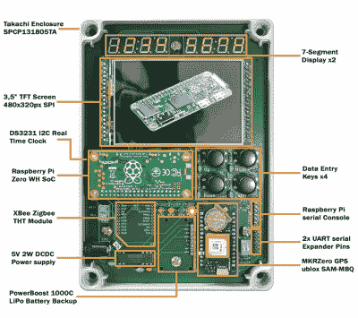

# 构建最终的 Raspberry Pi 自动化控制器

> 原文：<https://hackaday.com/2020/08/19/building-the-ultimate-raspberry-pi-automation-controller/>

在这一点上，我们已经数不清有多少自动化项目是由树莓派的某种变体来掌舵的。这不足为奇，因为这些板便宜、功能强大，而且有据可查。*不*使用 one 的理由清单从来都不算长，[但是随着【Frank】一直在研究的 PiCon One](https://hackaday.io/project/171999-picon-one)，它将变得更短。

 该项目采用 IP65 工业外壳的形式，支持 Raspberry Pi Zero W 插入的电子设备。虽然本质上是可扩展的，但[Frank]有一组核心功能，他的目标是作为基准，例如附加的串行端口、集成的不间断电源、电池供电的实时时钟(RTC)、可编程状态 led 阵列以及对 XBee 和 GPS 插件模块的支持。反馈通过一对四位七段显示器和一个运行自定义用户界面的彩色 320×480 TFT 屏幕提供。

[Frank]设想将 PiCon One 用作坚固的太阳能控制器，最终能够测量阵列输出、能耗，甚至操作电动支架，使电池板指向太阳。为此，他最近一直在尝试在 Pi 上运行 [JPL 的地平线软件](https://ssd.jpl.nasa.gov/?horizons)来实时确定太阳的位置。但这款设备的功能远不止于此，它将成为许多家庭甚至潜在工业应用的理想控制器。

 [https://www.youtube.com/embed/rOmu4ZDboUo?version=3&rel=1&showsearch=0&showinfo=1&iv_load_policy=1&fs=1&hl=en-US&autohide=2&wmode=transparent](https://www.youtube.com/embed/rOmu4ZDboUo?version=3&rel=1&showsearch=0&showinfo=1&iv_load_policy=1&fs=1&hl=en-US&autohide=2&wmode=transparent)

The [HackadayPrize2020](https://prize.supplyframe.com) is Sponsored by: