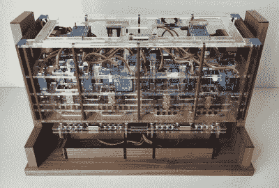

# 建造这个机械数字钟需要勇气

> 原文：<https://hackaday.com/2020/10/13/building-this-mechanical-digital-clock-took-balls/>

在对显示时间的独特方式的永无止境的探索中，黑客们会尝试任何事情。我们已经看到了这一切，或者至少我们认为我们已经看到了，然后出现了[这个纯机械的数字时钟，它只用钢珠](https://www.instructables.com/Mechanical-Digital-Steel-Ball-Clock/)来显示时间。我们绝对喜欢它！

Click to embiggen (you’ll be glad you did)

只要看一眼下面的静态图片或简短视频，你就会明白[Eric Nguyen]是如何做到这一点的。显示屏的每个部分由四个 0.25 英寸(6.35 毫米)的钢珠组成，由钟表普通木质表面后面的磁铁拾取并固定。但是完成这一任务所需的机电复杂性是该建筑令人印象深刻的部分。每一段需要两个伺服系统，庞大的 28 个单元加上一个结肠。此外，两个重型伺服系统需要倾斜头部，四个需要抬起装有钢珠的托盘，复杂程度非常高。然而，[埃里克]仍然设法使内部，这是挤满了激光切割丙烯酸骨架，整洁，像样，以及他可能，因为看着内部工作是相当令人满意的。

我们喜欢这个版本的工艺水平和创造力，祝贺[Eric]让他的第一个 Arduino 版本如此难以超越。我们以前也见过其他的[机械数字显示器](https://hackaday.com/2020/07/27/mechanical-seven-segment-display-really-sticks-out-from-the-pack/)，但是这个真的是一件艺术品。

 [https://www.youtube.com/embed/mdI39l8DD80?version=3&rel=1&showsearch=0&showinfo=1&iv_load_policy=1&fs=1&hl=en-US&autohide=2&wmode=transparent](https://www.youtube.com/embed/mdI39l8DD80?version=3&rel=1&showsearch=0&showinfo=1&iv_load_policy=1&fs=1&hl=en-US&autohide=2&wmode=transparent)

感谢[ 茹涵 范德伯格的提示。