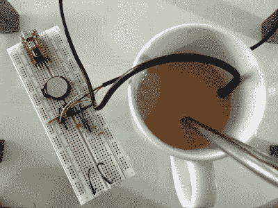
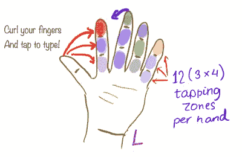

# Bunnie Huang 在 Hackaday 奖辅导会议上谈论制造和元件选择

> 原文：<https://hackaday.com/2019/06/21/bunnie-huang-talks-manufacturing-and-component-choices-during-hackaday-prize-mentoring-session/>

Andrew“Bunnie”Huang 在 Hackaday 奖的导师会议上展示了除非你经历过无数次硬件开发挑战，否则很难获得的经验和知识。这些大师班将产品开发专家与致力于将其项目转化为产品的有奖参赛者相匹配。我们一直在记录他们，以便所有人都可以从每次会议中分享的建议和指导中受益。

The appealing little FunKey pocket gaming platform.

邦尼是大多数黑客读者已经熟悉的人。他在我们社区的恶名始于近 20 年前他对最初的微软 X-box 进行逆向工程，他很快设计(并破解)了 Chumby Internet appliance，他创造了 Novena 开源笔记本电脑，通过他的写作和教学，他提供了在深圳采购电子制造的见解。他是你想在 [Hackaday 奖](https://prize.supplyframe.com/)参赛时拥有的导师，这正是我们放在休息时间下方的视频中一个幸运小组所拥有的。

虽然与 Bunnie 的这次会议已经板上钉钉，但值得提醒大家的是，我们仍在为 Hackaday 奖参赛者举办导师会议，因此[注册您的参赛作品](https://docs.google.com/forms/d/e/1FAIpQLSebsF7kT9FWRJs2MKrPvRZv5bx2eYmpc3N3aMSffP5Lk1tEcQ/viewform)有机会获得关于您项目的一些重要反馈。

第一个与邦尼见面的团队是 [FunKey](https://hackaday.io/project/164934-funkey-project-all-your-games-on-your-keychain) ，他的钥匙链类似任天堂的手持游戏平台的灵感来自一个 Sprite_tm 项目，该项目以一个转换的新奇玩具为特色。FunKey 团队已经做出了一个真正经过深思熟虑的设计，可以成为一个产品，但像我们许多已经达到这一点的人一样，他们面临着将它转化为产品的不可能的障碍。他们的会议重点是寻找制造合作伙伴和扩大生产的建议。

A prototype HotorNot Coffee Stirrer, showing their problem of having to maintain food-safe components.

[HotorNot 咖啡搅拌器](https://hackaday.io/project/165595-hotornot-coffee-stirrer)正试图克服他们食品相关项目中的一个独特问题。必须放入饮料中的热饮传感器必须是食品安全的，并且在两次使用之间易于清洗。讨论了各种元件，包括芯片上的热电堆，其优点是不需要与液体接触，但有时最简单的想法可能是最有效的，因为 Bunnie 提醒我们，廉价的医用温度计拆卸可以告诉我们许多关于这种应用的适当部件。

The idea behing PhalangePad is an attractive one, but making those sensors reliable is no trivial eercise.

这是另一个困扰[指骨垫](https://hackaday.io/project/165394-phalangepad)的组件选择问题，指骨垫是一种依靠用户用拇指敲击手指内侧的输入设备。这是一个伟大的想法，但如何检测这些“按键”？您会使用电容或磁传感器、力敏电阻，甚至机器视觉吗？在这里，Bunnie 的元件供应百科知识脱颖而出，其结果是对可用技术的迷人见解。

在我们的一生中，我们都积累了大量的知识，其中一些最有价值的知识很难以结构化的形式传递，而是作为偶然的见解出现。像邦尼这样经验丰富的工程师可以写一本关于中国制造电子产品的书，但仅仅几页纸仍然只能触及他对这个主题的了解的皮毛。这就是这些导师会议的价值所在，因为其中的知识瑰宝几乎是不经意间溜走的，如果你不看，你会错过它们。

这是我们今年 Hackaday 奖辅导系列的第二次，但我们已经在 can 和进一步的会议中记录了更多内容。我们一直在寻找更多的参与者，所以如果你还没有报名参加 [Hackaday 奖](https://prize.supplyframe.com/)的话，请确保你已经报名参加了，并查看了[的导师名单](https://hackaday.io/contest/164621-supplyframe-designlab-2019-hackaday-prize/log/163248-mentor-sessions)，他们将在这里分享他们的知识和经验。

 [https://www.youtube.com/embed/_DC7W9w66iI?version=3&rel=1&showsearch=0&showinfo=1&iv_load_policy=1&fs=1&hl=en-US&autohide=2&wmode=transparent](https://www.youtube.com/embed/_DC7W9w66iI?version=3&rel=1&showsearch=0&showinfo=1&iv_load_policy=1&fs=1&hl=en-US&autohide=2&wmode=transparent)

The [HackadayPrize2019](https://prize.supplyframe.com) is Sponsored by:     