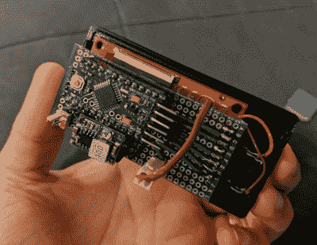

# 用这个 Arduino Reddit 浏览器消磨一些时间

> 原文：<https://hackaday.com/2018/10/30/burn-some-time-with-this-arduino-reddit-browser/>

如果你和我们一样，你可能花在浏览 Reddit 上的时间比你向朋友/家人/老板/治疗师承认的要多。看似无穷无尽的知识、智慧和迷因；困在 Reddit 上就像在维基百科上查找一些东西，然后设法花几个小时点击进入新的页面。但我们敢打赌，没有人比(萨阿德)更喜欢浏览 Reddit。

 他写信告诉我们他建造的手持设备[让他可以查看来自流行/r/showerthoughts sub](https://www.thingiverse.com/thing:3172692) 的随机帖子。每次按下红色大按钮都会传递另一份不可或缺的互联网智慧，当你需要一点额外的推动力来帮助你度过一天时，它是一个完美的桌面玩具。就像那些“一天一个单词”的日历，但是你真的会去读。

对于那些好奇[萨阿德]是如何用 Arduino 刮红 Reddit 的人来说，简短的回答是他没有。他的妻子为这个项目开发了一个在线工具( [/r/relationshipgoals/](https://www.reddit.com/r/relationshipgoals/) )，利用这个工具从 Reddit 上获取帖子，然后将帖子存入一个文本文件，这个文件可以放在设备的 SD 卡上。在/r/showerthoughts 上有 1500 个最高评级的帖子，他应该在一段时间内对内容很满意。

[Saad]在记录这一构建的硬件方面做得非常出色，提供了大量图片以及他使用的零件列表和一些帮助组装更容易的技巧。总的来说，这不是一个复杂的项目，但他的文档对那些可能没有生活和呼吸这种东西的人来说是一个很大的帮助。

对于高层次的总结:它使用了一个 Arduino Pro Mini，一个 ILI9341 屏幕，和一个 3.3 V 调节器来降压 5 V USB，而不是使用电池。一点 perfboard，一个 3D 打印的外壳，以及一个不可抗拒的大红色按钮将整个事情联系在一起。

几年前，我们已经在相框中看到过[类似的概念，但如果那不够互动，你可以随时](https://hackaday.com/2016/02/24/picture-frame-mashup-taps-subreddits-for-deep-thoughts/)[为自己打造一个 Reddit“控制器”](https://hackaday.com/2013/05/08/karma-controller-makes-reddit-a-game/)。