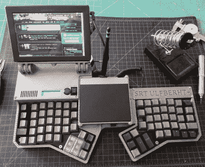

# 燃烧的铬

> 原文：<https://hackaday.com/2020/06/06/burning-chrome/>

你想要一个结合多门学科的好项目，最后给你一些有用的东西，而且一定会让麻瓜们惊叹不已？或者你只是需要一个定制的钻机来“接入”到“网络空间”？如何建立你自己的便携式电脑，有自己的风格——你自己的电脑平台？

从威廉·吉布森在《神经漫游者》(Neuromancer)、《零计数》(Count Zero)和《蒙娜丽莎超速行驶》(Mona Lisa Overdrive)中创造的富饶世界向你走来，网络甲板是漫游在这片土地上的英雄和反英雄用来连接互联网的便携式电脑。由于我们已经生活在一个世界的很大一部分被大公司控制的时代，我们一生都在网上度过，机器智能已经准备好变得有知觉，你也可以开始建造了。

 我们已经看到了许多[cyber deck 构建](https://hackaday.com/tag/cyberdeck/)的伟大范例，它们都有自己独特的方式，但它们都有共同的特征。首先，你需要一个屏幕、一个便携式电脑大脑、一些电池和一个漂亮的键盘。好消息是，在过去的几年里，以上所有的东西都变得非常容易买到，甚至很便宜。

原则#1 是 case modder 的原则。毕竟，你正在设计你理想的便携式电脑。它必须有[的外观*好的*](https://hackaday.com/2019/12/24/advancing-the-state-of-cyberdeck-technology/) ，我们不是指那种黑色、四四方方的 ThinkPad 外观。如果你有一台 3D 打印机，或者愿意喷漆，这个世界就是你的了。

 学科二是键盘建造者。你不会希望进入矩阵时没有一个令人愉快的输入界面。同样，3D 打印、[激光切割](https://hackaday.com/2019/10/05/a-cyberdeck-built-with-ergonomics-in-mind/)或[数控铣削自己的键盘](https://hackaday.com/2020/06/03/a-dual-screen-luggable-with-integrated-rtl-sdr/)并从头开始为自己打造一个键盘是一个可行的选择，但如果你想抄近路，或找到一个你真正喜欢的键盘，有大量的蓝牙和 USB 键盘选项。

规则 3 是软件黑客。组装完全正确的软件，设置系统做你想做的事情，以及获得那个甜美的背景屏幕*恰到好处*是让你在网络空间如鱼得水的最后一步。

有如此多的自由将你自己的设计理念引入你的定制旅行包，没有两个是相同的。我的电脑将为我经常使用的每个微控制器提供编程端口，一个像样的扬声器，也许是一个可变电源，可能还有一些合理数量的 LED 灯。你的上面会有什么？

这篇文章是 Hackaday.com 时事通讯的一部分，在过去的 200 多周中，每七天发表一次。它还包括过去七天我们最喜欢的文章，您可以在[新闻简报](https://mailchi.mp/hackaday.com/hackaday-newsletter-0xd2)的网络版上看到。

想让这种类型的文章在每周五早上出现在你的收件箱里吗？[你要报名](http://eepurl.com/gTMxQf)！